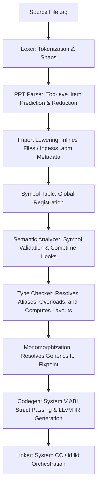

# Silver Compiler Agent Guide (AGENTS.md)

This document is the authoritative technical reference for the Silver systems programming language compiler (`agc`) and runtime. It defines the architecture, pipeline stages, syntax specifications, memory management model, coding invariants, and guidelines for future development passes.

---

## 1. Project Overview

Silver is a statically typed, LLVM-backed systems programming language exploring a design space between raw C-level control and modern ergonomics.

### Core Architecture Goals
- **Explicit over Implicit**: Memory transfers must be marked with explicit moves (`move expr`), and method receivers explicitly declare their pointer type (`Self* self`).
- **Deterministic Resource Management (RAII)**: Scoped cleanup through the `Drop` trait and compiler-generated drop flags, allowing deterministic object destruction on block exit.
- **Zero-Cost Abstractions**: Generics monomorphize at compile-time to concrete struct/enum layout configurations and mangled function symbols.
- **Packaged Module Resolution**: Packages can be imported as source files (which are inlined) or loaded as binary metadata modules (`.agm` artifacts).

---

## 2. Repository Structure

```
silver/
├── agc/                         # The Silver compiler source code (Rust crate)
│   ├── src/
│   │   ├── main.rs              # Compiler driver, CLI options parsing, and build orchestrator
│   │   ├── lib.rs               # Exported frontend modules (for reuse by tooling/LSP)
│   │   ├── lexer.rs             # Token definition, lexical scanner, and spans
│   │   ├── parser/              # Syntactic analysis and import resolution
│   │   │   ├── ast.rs           # Core Abstract Syntax Tree definitions
│   │   │   ├── error.rs         # Syntax errors mapping source spans
│   │   │   ├── import_hook.rs   # Lowers import nodes by inlining files or resolving modules
│   │   │   └── prt_parser.rs    # Predictive Reduction Table parser
│   │   ├── semantic/            # Semantic analysis, type checking, and monomorphization
│   │   │   ├── analyzer.rs      # Global symbol registration and duplicate detection
│   │   │   ├── typeck.rs        # Type-checking rules, layout computing, and trait validation
│   │   │   └── monomorph.rs     # Generics fixpoint monomorphization engine
│   │   ├── codegen/             # Target code generation
│   │   │   ├── abi.rs           # System V AMD64 ABI struct classification handler
│   │   │   └── llvm_ir.rs       # Inkwell-based LLVM IR builder
│   │   ├── symbol_table.rs      # Phase-aware compiler symbol registration & scopes
│   │   ├── diagnostics.rs       # Clang-style caret-underline error visualizer
│   │   └── profiler.rs          # Simple phase timing instrumenter
├── silver_runtime/              # Small support library for generated executables
├── std/                         # Silver standard library sources (bootstrap-copied)
│   ├── mem/                     # Allocator, smart pointers (Box, Rc, Vec, Arena)
│   └── ops.ag                   # Core arithmetic and index operator overloading traits
├── bootstrap/                   # Cache directory for local development tools and prebuilt std
├── tests/                       # Test suite including integration tests
└── scripts/                     # Packaging and release scripts
```

---

## 3. Build & Test

### Development Commands

1. **Build the Compiler**:
   ```bash
   cargo build -p agc
   ```
2. **Run the Test Suite**:
   ```bash
   cargo test -p agc
   ```
3. **Rebuild the Bootstrap Artifacts**:
   ```bash
   bash ./update-bootstrap.sh
   ```
   *Note: This is the ONLY correct way to update bootstrap. The script compiles `agc` in release mode, copies it to `bootstrap/bin/`, copies library files (`std/`) to `bootstrap/include/silver/`, and generates compiled module packages (`.agm` artifacts) in `bootstrap/lib/silver/`. Manual `cp` commands will miss the module packaging step and produce inconsistent bootstrap artifacts. Always run this script after compiler changes or std lib changes.*
   
   **IMPORTANT**: Bootstrap updates MUST be committed as a **separate, dedicated commit** — never squash them into a feature commit. This keeps the bootstrap binary and module artifacts independently reviewable and revertable.
4. **Compile a Silver file**:
   ```bash
   cargo run -p agc -- path/to/file.ag
   ```

---

## 4. Compiler Pipeline



### Detailed Compiler Stages

#### 1. Lexer (`lexer.rs`)
- Scans raw text into a flat vector of `LexToken` containing the enum token type, exact character spans, and lexed text.
- Supports multi-character tokens, complex numbers (e.g. `3.5i`), escape sequences, and keyword mapping.

#### 2. Parser (`parser/prt_parser.rs`)
- Operates as a **Predictive Reduction Table (PRT) Parser**.
- Looks ahead at the start of top-level blocks to map tokens to `TokenClass` (e.g., `Struct`, `Enum`, `Impl`, `TypeStart`) and predicts which `ItemProduction` to instantiate.
- Finds item boundary segments (`find_item_end`) and executes a specialized reduction parser block on that slice of tokens.

#### 3. Import Lowering (`parser/import_hook.rs`)
- Resolves module import directives (`import std.io;`) recursively:
  - **Source File Imports**: The target `.ag` file is parsed, its imports recursively lowered, and its AST items are **fully inlined** into the importing program's item list.
  - **Precompiled Module Imports**: Reads compiled `.agm` binary artifacts containing magic header `AGM\x00\x00\x02`. These exports are cached as type signatures in `module_imports` and not merged directly into the AST items.

#### 4. Symbol Table Init (`symbol_table.rs`)
- Registers top-level functions, structs, globals, and traits.
- Tracks phase-based transitions (`CompilerPhase`) and maintains scopes for local variables.

#### 5. Semantic Analyzer (`semantic/analyzer.rs`)
- Performs static checks (checking for duplicate symbols and validating declaration formats).
- Runs `SemanticAnalyzerHook` steps, such as `ComptimeCastHook`, which folds constant casts (e.g. `comptime (i32) 3.9` into `3`).

#### 6. Type Checker (`semantic/typeck.rs`)
- Calculates struct memory layouts (System V / C structure alignment).
- Enforces trait bounds and matches type signatures.
- Maps arithmetic/logical expressions to overloaded methods (traits like `Add`, `Eq`, `IndexedAccess` in `std.ops`) by searching for double-underscored matching functions (e.g., `__add`, `__index_get`).
- Generates type error reports and compiles `MonomorphRequest` generics requests.

#### 7. Monomorphization (`semantic/monomorph.rs`)
- Runs a fixpoint generation loop:
  - Discovers template types (structs, enums, impls, functions) matching type signatures in `MonomorphRequest`.
  - Replaces type variables with concrete types and mangles the new struct/method names.
  - Instantiates nested generic calls inside monomorphized code to fixpoint.

#### 8. Codegen (`codegen/llvm_ir.rs`)
- Leverages the `inkwell` LLVM bindings wrapper.
- Interfaces with target machine layouts via `codegen/abi.rs`, classifying struct layouts <= 8 bytes, <= 16 bytes, and > 16 bytes according to System V AMD64 ABI specifications.
- Translates syntax constructs (variables, scopes, defer blocks, drop flags, and inline `asm`) into native LLVM IR code.

#### 9. Linker (`main.rs` link driver)
- Compiles generated LLVM IR into temporary object files.
- Invokes target toolchains (system `cc` or `ld.lld`) to perform symbol resolution, linking in required library dependencies and producing executables or shared libraries.

---

## 5. Coding Style & Conventions

- **Compiler Implementation (Rust)**:
  - Avoid duplicate semantic checks; separate parsing/lowering and typecheck/codegen.
  - Keep pipeline passes strictly isolated. No code generation or type resolution should occur during parsing.
  - Maintain absolute correctness in target data layouts. Do not guess structure alignments.
- **Silver Language Idioms**:
  - Struct constructors are standard static methods returning a moved instance:
    ```silver
    pub Rc<T> new(T val) {
        // ...
        return move rc;
    }
    ```
  - Instance methods take the receiver explicitly as the first argument, typically as a pointer:
    ```silver
    pub T* get(Rc<T>* self) {
        return (*self).ptr;
    }
    ```

---

## 6. Memory & Ownership Conventions

The Silver compiler implements a lightweight deterministic memory and resource control protocol using a drop-flag stack machine.

### Critical Invariants

1. **No Automatic Field Cleanups**:
   - The compiler does *not* recursively drop fields when a struct goes out of scope.
   - Structs that own resources *must* explicitly call drop on their fields in their own `drop` trait implementation.
     ```silver
     void drop(HasInner* self) {
         (*self).inner.drop(); // REQUIRED: explicit manual field drop call
     }
     ```
2. **Pointer/Reference Exemption**:
   - The compiler only tracks ownership and emits destructors for value-type variables.
   - Pointers (`T*`) and reference types are assumed to be non-owning views and are never automatically dropped.
3. **Explicit Move Semantics (`move`)**:
   - Marking a variable transfer with `move x` invalidates the local resource inside the caller's stack frame.
   - Under the hood, LLVM codegen allocates a 1-bit drop flag (`{var_name}.drop`) for each tracked local variable, initialized to `true` (1).
   - A `move` expression sets this drop flag to `false` (0).
4. **Deferred Cleanup Stack (`defers`)**:
   - Scope exit drops are placed on a deferred stack.
   - When exiting a block, the compiler emits code to check the corresponding drop flags. If `true`, the destructor is called. If `false` (i.e. moved), the destructor call is skipped.
5. **Return and Exit Handling (Bug A/B/C Invariants)**:
   - When executing `return expr;`, the compiler evaluates the expression value first, saves it in a temporary register, runs all pending `defers` up to the function scope level, and then issues the final return instruction. This avoids use-after-free conditions.
   - Function parameter variables receive drop-flag allocations and are dropped on function exit.
   - *Known Design Limitation (Bug C)*: Local variables declared but not initialized have their drop flags set to `true` by default, which can cause spurious drops on zero-initialized fields if the type does not perform pointer-null checks in its `drop` method.

---

## 7. Diagnostics

Compiler diagnostic messages are rendered using the `diagnostics::render` utility.
- Formatting reports: `file:line:col: error/warning: message` followed by the source line text and carets (`^`) pointing to the span.
- Severity levels are defined by the `Severity` enum (`Error` or `Warning`).

---

## 8. Testing Expectations

### Writing Tests
- All language features should be tested using both unit tests in `agc/src/` (e.g. mock AST tests in `typeck.rs`, `monomorph.rs`) and integration test scripts in `tests/`.
- The suite at `tests/memory_pentest.ag` acts as the definitive regression suite for verifying RAII, move semantics, nested scopes, loop breaks/continues, and early returns. Any modifications to compiler pass structures must verify cleanly against this suite.

---

## 9. Performance Guidelines

- **Arena Allocations**: Avoid heavy heap thrashing in time-sensitive code paths. Use stdline `std.mem.arena` or `bootstrap` caches where possible.
- **Timing and Profiling**: Executing `agc` with `--profile` triggers phase timing reports, detailing milliseconds spent in `read source`, `lex`, `parse`, `import lowering`, `semantic`, `type check`, `monomorph`, `codegen`, and `link`. Keep compile times lean and optimize pass loops.

---

## 10. Feature Implementation Checklist

When introducing a new syntax item or language capability, follow this checklist sequentially:

1. **Lexer (`lexer.rs`)**:
   - Define a token variant in `Token` enum.
   - Add scanner rules mapping keyword text or character sequences to the token.
2. **AST (`parser/ast.rs`)**:
   - Add the AST structural representation (struct or enum variant).
3. **Parser (`parser/prt_parser.rs`)**:
   - Register token class mappings in `TokenClass` if lookahead is affected.
   - Implement the syntactic reduction rule function mapping from token streams to your AST node.
4. **Symbol Table (`symbol_table.rs`)**:
   - Add a matching `SymbolKind` if the new item defines a scope or binds names.
   - Implement name recording in `record_item_symbols`.
5. **Semantic Analyzer (`semantic/analyzer.rs`)**:
   - Implement validation functions to check scope constraints or duplicate definitions.
6. **Type Checker (`semantic/typeck.rs`)**:
   - Add type-checking rules. Register types, check signature compatibility, and compute layouts.
7. **Monomorphization (`semantic/monomorph.rs`)**:
   - Register the generic pattern if the feature supports generic parameters. Implement type mappings.
8. **Codegen (`codegen/llvm_ir.rs`)**:
   - Add code generation logic translating the AST nodes to LLVM instructions.
   - Setup debug info lines, stack allocations, drop flags, and defer stack scopes if needed.
9. **Tests**:
   - Add unit tests verifying compiler behavior under `agc/src/`.
   - Add integration files in `tests/` to run final compilation and execute the generated binary.

---

## 11. Things Never To Do

- **DO NOT** mix compilation phases. Do not perform type checking or code generation directly inside the parser, and do not resolve imports during codegen.
- **DO NOT** assume struct fields are recursively dropped. You must write explicit drops inside custom destructors.
- **DO NOT** guess platform layout dimensions. Always use target data classification interfaces provided by System V AMD64 ABI specifications in `codegen/abi.rs`.
- **DO NOT** modify the runtime (`silver_runtime/`) in a way that breaks compatibility with bootstrapped compiler modules. Always run `bash ./update-bootstrap.sh` to ensure consistency.
- **DO NOT** squash bootstrap updates into feature commits. Bootstrap artifacts MUST be committed as a separate, dedicated commit — never mixed with source changes. This keeps the binary and module artifacts independently reviewable and revertable.
