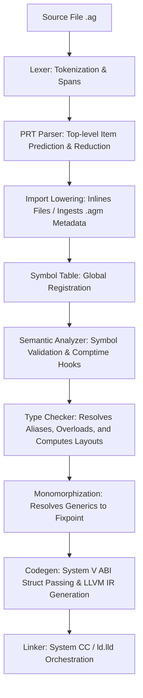

# Silver Compiler Agent Guide (AGENTS.md)

This document is the authoritative technical reference for the Silver systems programming language compiler (`agc`) and runtime. It defines the architecture, pipeline stages, syntax specifications, memory management model, coding invariants, and guidelines for future development passes.

---

## 1. Project Overview

Silver is a statically typed, LLVM-backed systems programming language exploring a design space between raw C-level control and modern ergonomics.

### Core Architecture Goals
- **Explicit over Implicit**: Memory transfers must be marked with explicit moves (`move expr`), and method receivers explicitly declare their pointer type (`Self* self`).
- **Deterministic Resource Management (RAII)**: Scoped cleanup through the `Drop` trait and compiler-generated drop flags, allowing deterministic object destruction on block exit.
- **Zero-Cost Abstractions**: Generics monomorphize at compile-time to concrete struct/enum layout configurations and mangled function symbols.
- **Packaged Module Resolution**: Packages can be imported as source files (which are inlined) or loaded as binary metadata modules (`.agm` artifacts).

---

## 2. Repository Structure

```
silver/
├── agc/                         # The Silver compiler source code (Rust crate)
│   ├── src/
│   │   ├── main.rs              # Compiler driver, CLI options parsing, and build orchestrator
│   │   ├── lib.rs               # Exported frontend modules (for reuse by tooling/LSP)
│   │   ├── lexer.rs             # Token definition, lexical scanner, and spans
│   │   ├── parser/              # Syntactic analysis and import resolution
│   │   │   ├── ast.rs           # Core Abstract Syntax Tree definitions
│   │   │   ├── error.rs         # Syntax errors mapping source spans
│   │   │   ├── import_hook.rs   # Lowers import nodes by inlining files or resolving modules
│   │   │   └── prt_parser.rs    # Predictive Reduction Table parser
│   │   ├── semantic/            # Semantic analysis, type checking, and monomorphization
│   │   │   ├── analyzer.rs      # Global symbol registration and duplicate detection
│   │   │   ├── typeck.rs        # Type-checking rules, layout computing, and trait validation
│   │   │   └── monomorph.rs     # Generics fixpoint monomorphization engine
│   │   ├── codegen/             # Target code generation
│   │   │   ├── abi.rs           # System V AMD64 ABI struct classification handler
│   │   │   └── llvm_ir.rs       # Inkwell-based LLVM IR builder
│   │   ├── symbol_table.rs      # Phase-aware compiler symbol registration & scopes
│   │   ├── diagnostics.rs       # Clang-style caret-underline error visualizer
│   │   └── profiler.rs          # Simple phase timing instrumenter
├── std/                         # Silver standard library sources (bootstrap-copied)
│   ├── mem/                     # Allocator, smart pointers (Box, Rc, Vec, Arena)
│   ├── rt/                      # Pure-Silver runtime: GC heap, type system, casts, method dispatch, Runtime aggregate
│   └── ops.ag                   # Core arithmetic and index operator overloading traits
├── bootstrap/                   # Generated locally — NOT committed to git
├── tests/                       # Test suite including integration tests
└── scripts/                     # Packaging and release scripts
```

---

## 3. Build & Test

### Development Commands

1. **Build the Compiler**:
   ```bash
   cargo build -p agc
   ```
2. **Run the Test Suite**:
   ```bash
   cargo test -p agc
   ```
3. **Compile a Silver file**:
   ```bash
   cargo run -p agc -- path/to/file.ag -o out
   ```
4. **Fast Frontend-Only Typecheck (`agc check`)**:
   ```bash
   cargo run -p agc -- check path/to/file.ag
   ```
5. **Compile and Run (`agc run`)**:
   ```bash
   cargo run -p agc -- run path/to/file.ag [args...]
   ```

---

## 4. Compiler Pipeline


```mermaid
flowchart TD
    Source[Source File .ag] --> Lex[Lexer: Tokenization & Spans]
    Lex --> Parse[PRT Parser: Top-level Item Prediction & Reduction]
    Parse --> Import[Import Lowering: Inlines Files / Ingests .agm Metadata]
    Import --> SymInit[Symbol Table: Global Registration]
    SymInit --> Semantic[Semantic Analyzer: Symbol Validation & Comptime Hooks]
    Semantic --> TypeCheck[Type Checker: Resolves Aliases, Overloads, and Computes Layouts]
    TypeCheck --> Monomorph[Monomorphization: Resolves Generics to Fixpoint]
    Monomorph --> Codegen[Codegen: System V ABI Struct Passing & LLVM IR Generation]
    Codegen --> Link[Linker: System CC / ld.lld Orchestration]
```

### Detailed Compiler Stages

#### 1. Lexer (`lexer.rs`)
- Scans raw text into a flat vector of `LexToken` containing the enum token type, exact character spans, and lexed text.
- Supports multi-character tokens, complex numbers (e.g. `3.5i`), escape sequences, and keyword mapping.

#### 2. Parser (`parser/prt_parser.rs`)
- Operates as a **Predictive Reduction Table (PRT) Parser**.
- Looks ahead at the start of top-level blocks to map tokens to `TokenClass` (e.g., `Struct`, `Enum`, `Impl`, `TypeStart`) and predicts which `ItemProduction` to instantiate.
- Finds item boundary segments (`find_item_end`) and executes a specialized reduction parser block on that slice of tokens.

#### 3. Import Lowering (`parser/import_hook.rs`)
- Resolves module import directives (`import std.io;`) recursively:
  - **Source File Imports**: The target `.ag` file is parsed, its imports recursively lowered, and its AST items are **fully inlined** into the importing program's item list.
  - **Precompiled Module Imports**: Reads compiled `.agm` binary artifacts containing magic header `AGM\x00\x00\x02`. These exports are cached as type signatures in `module_imports` and not merged directly into the AST items.

#### 4. Symbol Table Init (`symbol_table.rs`)
- Registers top-level functions, structs, globals, and traits.
- Tracks phase-based transitions (`CompilerPhase`) and maintains scopes for local variables.

#### 5. Semantic Analyzer (`semantic/analyzer.rs`)
- Performs static checks (checking for duplicate symbols and validating declaration formats).
- Runs `SemanticAnalyzerHook` steps, such as `ComptimeCastHook`, which folds constant casts (e.g. `comptime (i32) 3.9` into `3`).

#### 6. Type Checker (`semantic/typeck.rs`)
- Calculates struct memory layouts (System V / C structure alignment).
- Enforces trait bounds and matches type signatures.
- Maps arithmetic/logical expressions to overloaded methods (traits like `Add`, `Eq`, `IndexedAccess` in `std.ops`) by searching for double-underscored matching functions (e.g., `__add`, `__index_get`).
- Generates type error reports and compiles `MonomorphRequest` generics requests.

#### 7. Monomorphization (`semantic/monomorph.rs`)
- Runs a fixpoint generation loop:
  - Discovers template types (structs, enums, impls, functions) matching type signatures in `MonomorphRequest`.
  - Replaces type variables with concrete types and mangles the new struct/method names.
  - Instantiates nested generic calls inside monomorphized code to fixpoint.

#### 8. Codegen (`codegen/llvm_ir.rs`)
- Leverages the `inkwell` LLVM bindings wrapper.
- Interfaces with target machine layouts via `codegen/abi.rs`, classifying struct layouts <= 8 bytes, <= 16 bytes, and > 16 bytes according to System V AMD64 ABI specifications.
- Translates syntax constructs (variables, scopes, defer blocks, drop flags, and inline `asm`) into native LLVM IR code.

#### 9. Linker (`main.rs` link driver)
- Compiles generated LLVM IR into temporary object files.
- Invokes target toolchains (system `cc` or `ld.lld`) to perform symbol resolution, linking in required library dependencies and producing executables or shared libraries.

---

## 5. Coding Style & Conventions

- **Compiler Implementation (Rust)**:
  - Avoid duplicate semantic checks; separate parsing/lowering and typecheck/codegen.
  - Keep pipeline passes strictly isolated. No code generation or type resolution should occur during parsing.
  - Maintain absolute correctness in target data layouts. Do not guess structure alignments.
- **Silver Language Idioms**:
  - Struct constructors are standard static methods returning a moved instance:
    ```silver
    pub Rc<T> new(T val) {
        // ...
        return move rc;
    }
    ```
  - Instance methods take the receiver explicitly as the first argument, typically as a pointer:
    ```silver
    pub T* get(Rc<T>* self) {
        return (*self).ptr;
    }
    ```

---

## 6. Memory & Ownership Conventions

The Silver compiler implements a lightweight deterministic memory and resource control protocol using a drop-flag stack machine.

### Critical Invariants

1. **Automatic Field Cleanups**:
   - The compiler automatically drops struct fields after the struct's own `drop` method returns.
   - Struct `drop` methods do NOT need to explicitly call `drop()` on fields — the compiler handles this.
   - The `drop` method is for cleaning up non-field resources (e.g., freeing pointers, closing fds).
     ```silver
     void drop(HasInner* self) {
         // inner is dropped automatically by the compiler — no explicit call needed.
         outer_drop_count = outer_drop_count + 1;
     }
     ```
2. **Pointer/Reference Exemption**:
   - The compiler only tracks ownership and emits destructors for value-type variables.
   - Pointers (`T*`) and reference types are assumed to be non-owning views and are never automatically dropped.
3. **Explicit Move Semantics (`move`)**:
   - Marking a variable transfer with `move x` invalidates the local resource inside the caller's stack frame.
   - Under the hood, LLVM codegen allocates a 1-bit drop flag (`{var_name}.drop`) for each tracked local variable, initialized to `true` (1).
   - A `move` expression sets this drop flag to `false` (0).
4. **Deferred Cleanup Stack (`defers`)**:
   - Scope exit drops are placed on a deferred stack.
   - When exiting a block, the compiler emits code to check the corresponding drop flags. If `true`, the destructor is called. If `false` (i.e. moved), the destructor call is skipped.
5. **Return and Exit Handling (Bug A/B/C Invariants)**:
   - When executing `return expr;`, the compiler evaluates the expression value first, saves it in a temporary register, runs all pending `defers` up to the function scope level, and then issues the final return instruction. This avoids use-after-free conditions.
   - Function parameter variables receive drop-flag allocations and are dropped on function exit.
   - *Known Design Limitation (Bug C)*: Local variables declared but not initialized have their drop flags set to `true` by default, which can cause spurious drops on zero-initialized fields if the type does not perform pointer-null checks in its `drop` method.
6. **Per-Field Drop Flags**: each Drop-typed struct field has its own i1 flag (initialized `false` = "no live value yet"), set on field assignment / struct init / by-value params, cleared on move. The scope-exit field cascade checks per-field flags, so uninitialized fields are never destructed; overwriting a field (`x.f = y`) releases the old value (guarded by the field flag).
7. **Enum Payload Ownership**: constructing a variant with an owned payload requires `move` (`Res.Ok(move i)` — a bare `Res.Ok(i)` is a compile error). Enums WITHOUT a Drop impl of their own get a tag-aware payload cascade: the active variant's Drop-typed payload is dropped at scope exit (so a never-unwrapped `Result<Owned, E>` does not leak). Extract owned payloads with a `move` binding — `match r { Ok(move v) : v, ... }` — which transfers ownership and zeroes the enum's slot (freeing via a plain binding copy now double-frees, since the cascade still runs). Enums WITH a Drop impl manage their payloads in the drop body and get no cascade.

---

## 7. Diagnostics

Compiler diagnostic messages are rendered using the `diagnostics::render` utility.
- **Centralized message catalog**: every user-facing diagnostic string lives in `agc/src/diagnostics/messages.rs` as a named function (`msg::unknown_identifier`, `msg::type_mismatch`, `msg::use_of_moved_value`, ...). Passes import `crate::diagnostics::messages as msg` and call catalog functions instead of inlining literals — editing/translating messages is a single-file change.
- Formatting reports: `error: file:line:col: message` or `warn: file:line:col: message` followed by the source line text and carets (`^`) pointing precisely to the span (with automatic tab expansion for character alignment).
- Severity levels are defined by the `Severity` enum (`Error`, `Warning`, or `Note`).
- **Multi-Span Move Diagnostics**: `move_check` records the original move site and reason, rendering a secondary `note: file:line:col: value explicitly moved here` under use-after-move errors.
- **Compiler Warning System & Linter**: Configured via `-Wall`, `-Werror` (treat warnings as errors), `-Wunused`, `-Wunreachable-code`, and `-Wno-*` flags. Detects unused variables/parameters (suppressed with `_` prefix) and unreachable statements following unconditional returns/breaks/continues.
- **Fuzzy Typo Suggestions ("Did you mean ...?")**: Levenshtein distance matching generates suggestion suffixes (`did you mean '...'?`) across unknown identifiers, struct fields, methods, types/enums, traits, and compiler-builtin macros.
- **In-Memory Formatting (`@format`)**: Builtin macro `@format("...", args...)` builds a formatted heap string into an owned `String` instance.
- **LSP Diagnostic Routing**: `aglsp` filters diagnostics by `file_id`, mapping errors occurring in inlined/imported files against their original source text and publishing to their respective file URIs without corrupting the open buffer's span ranges.
## 7.1 Debugging Support (DWARF by default)

DWARF is emitted by default for non-release builds (no `-O` / `-O0`) and
stripped for release builds (`-O1+`). `-g` forces it on, `-g0` (normalized
to `--g0` by the `main.rs` shim — clap shorts are single characters) forces
it off; an explicit flag always wins.

Full DWARF (not just line tables):
- Basic types (ints, floats, bool, char, str), pointers, arrays, and struct types with member offsets; recursive structs are cycle-guarded (members referencing the type under construction fall back to `u8*`).
- `DILocalVariable` + `llvm.dbg.declare` records for parameters, let bindings, range/iterator for-loop bindings, and enum payload match bindings — gdb can `print` locals, inspect struct fields, and watch variables. Enum values themselves have no DWARF mapping (prints as raw bytes); pointers to enums show as `u8*`.
- Multi-file source maps: spans from inlined `std/`/imported files resolve against their own `DIFile`/`SourceMap` in `DebugContext.files`, so breakpoints inside std code hit at the right file/line.
- Generic instances emitted lazily mid-codegen (`Vec::drop`, `realloc<T>`, ...) are suppressed from debug output (LLVM 22's DbgRecord DIE construction crashes on their dangling scope chains); their enclosing function's debug state is saved/restored around the emission (`debug_nested` flag). Lexical blocks are tagged with their owning subprogram so they never leak into another function's scope chain.
- **LLVM 22 invariants (all three crash the backend if violated):** (1) a `DILexicalBlock` may never be parented to the compile unit — it materializes as a broken `scope: null` node and ISel's `LexicalScopes::scanFunction` segfaults, so `push_lexical_block` returns false (callers skip the matching pop) when `current_scope()` is the CU; (2) a `DILocation` must never be scoped to the CU (`DwarfDebug::finishEntityDefinitions` dies in `DIE::getUnitDie`), so `set_debug_location` is a no-op while `debug_nested`; (3) nested lazy emissions must save/restore both `debug_nested` and `current_subprogram` — an inner instantiation otherwise leaves the outer function with a None subprogram and its remaining variables get invalid CU-scoped debug info. The full integration suite compiles with DWARF on by default, and `opt -passes=verify` on the emitted IR is clean.
- Every function carries the `"frame-pointer"="all"` attribute so the runtime backtrace walker can follow the rbp chain at any opt level.

## 7.2 Runtime Backtraces

The compiler emits a link-time-resolved symbol table for every function with a body:
- `@__silver_bt_entries` (linkonce_odr, pointer to a private `[N x {i64 addr, u8* name}]` array; `addr` is `ptrtoint(ptr @F to i64)` in a global initializer, resolved by the linker) and `@__silver_bt_count`.
- `linkonce_odr` dedups the table when .agm library objects are linked into a consumer — the application's own copy (first in link order) wins, so its addresses match the final binary.
- `std/rt/backtrace.ag` walks the rbp chain (inline asm reads rbp), resolves each return address to the entry with the largest `addr <= ret_addr`, and prints `#N  <name> (0x...)` to stderr. `abort()` (in `std/mem/memory.ag`) and `__silver_assert_failed` print the trace before dying.
- **Exact source lines and argument values** come from a compiler post-pass: after emitting the object, `agc/src/codegen/dwarf_bt.rs` parses the object's ELF + DWARF (`.symtab`, `.debug_line` v4/v5, `.debug_info`/`.debug_abbrev`/`.debug_str` — including relocations) and folds the results into alloc'd, link-time-resolved tables: `__silver_bt_lines` ({fn start, offset, line, file} per line transition) and `__silver_bt_args` ({fn start, count, args} where each arg = {name, rbp-relative fbreg, size}; the DWARF frame base is rbp, so the slot is `rbp + fbreg`). The object is then re-emitted with the tables. Frames print the call-site line (`level3 at probe.ag:4` — the assert's line) and `args: x=42`. Without DWARF (`-O1+`, `-g0`) the tables are empty and the trace falls back to declaration lines, no args.
- Integration test: `tests/backtrace_test.ag` (exit 134 + the harness greps stderr for the resolved `level1`/`level2`/`level3`/`main` names and `args: x=`).

## 7.3 Leak-Check Allocation Origins

Under `--leak-check`, the debug allocator (`std/mem/alloc.ag`) captures the caller's return address by walking up the `%rbp` frame pointer chain past allocator internals (`__silver_leak_alloc`, `mem_alloc_impl`, `alloc<T>`).
When unreleased memory remains at process exit, `__silver_leak_check_report()` resolves the return address via `bt_resolve` and `bt_line_lookup`, reporting the exact allocation call site:
```
leak-check: leak ptr=0x... size=64 allocated at create_user (test.ag:15)
```

---

## 8. Testing Expectations

### Writing Tests
- All language features should be tested using both unit tests in `agc/src/` (e.g. mock AST tests in `typeck.rs`, `monomorph.rs`) and integration test scripts in `tests/`.
- The suite at `tests/memory_pentest.ag` acts as the definitive regression suite for verifying RAII, move semantics, nested scopes, loop breaks/continues, and early returns. Any modifications to compiler pass structures must verify cleanly against this suite.

---

## 9. Performance Guidelines

- **Arena Allocations**: Avoid heavy heap thrashing in time-sensitive code paths. Use stdline `std.mem.arena` or `bootstrap` caches where possible.
- **Timing and Profiling**: Executing `agc` with `--profile` triggers phase timing reports, detailing milliseconds spent in `read source`, `lex`, `parse`, `import lowering`, `semantic`, `type check`, `monomorph`, `codegen`, and `link`. Keep compile times lean and optimize pass loops.

---

## 10. Feature Implementation Checklist

When introducing a new syntax item or language capability, follow this checklist sequentially:

1. **Lexer (`lexer.rs`)**:
   - Define a token variant in `Token` enum.
   - Add scanner rules mapping keyword text or character sequences to the token.
2. **AST (`parser/ast.rs`)**:
   - Add the AST structural representation (struct or enum variant).
3. **Parser (`parser/prt_parser.rs`)**:
   - Register token class mappings in `TokenClass` if lookahead is affected.
   - Implement the syntactic reduction rule function mapping from token streams to your AST node.
4. **Symbol Table (`symbol_table.rs`)**:
   - Add a matching `SymbolKind` if the new item defines a scope or binds names.
   - Implement name recording in `record_item_symbols`.
5. **Semantic Analyzer (`semantic/analyzer.rs`)**:
   - Implement validation functions to check scope constraints or duplicate definitions.
6. **Type Checker (`semantic/typeck.rs`)**:
   - Add type-checking rules. Register types, check signature compatibility, and compute layouts.
7. **Monomorphization (`semantic/monomorph.rs`)**:
   - Register the generic pattern if the feature supports generic parameters. Implement type mappings.
8. **Codegen (`codegen/llvm_ir.rs`)**:
   - Add code generation logic translating the AST nodes to LLVM instructions.
   - Setup debug info lines, stack allocations, drop flags, and defer stack scopes if needed.
9. **Tests**:
   - Add unit tests verifying compiler behavior under `agc/src/`.
   - Add integration files in `tests/` to run final compilation and execute the generated binary.

---

## 11. Things Never To Do

- **DO NOT** mix compilation phases. Do not perform type checking or code generation directly inside the parser, and do not resolve imports during codegen.
- **DO NOT** assume struct fields are recursively dropped. You must write explicit drops inside custom destructors.
- **DO NOT** guess platform layout dimensions. Always use target data classification interfaces provided by System V AMD64 ABI specifications in `codegen/abi.rs`.
- **DO NOT** modify the runtime (`std/rt/') in a way that breaks compatibility with existing test suite expectations. Always run 'bash tests/run_tests.sh' after changes.
