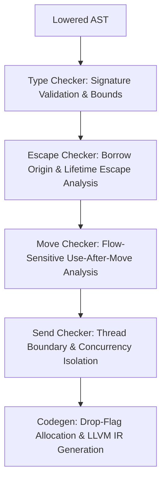

# Silver Borrow Checker & Ownership System

The Silver systems programming language combines explicit C-level memory control with compiler-enforced deterministic resource management (RAII), path-sensitive move tracking, and borrow escape analysis.

---

## 1. Overview & Core Philosophy

Silver's memory model is built on three core pillars:

1. **Explicit over Implicit Ownership**: Value types (`T`) are owning values. Pointers (`T*`) and references (`&T`, `&mut T`) are non-owning views and are never automatically dropped. Moves must be explicit (`move x`) or structural (bare `return x`).
2. **Deterministic Drop-Flag Machine**: Destructors (`impl Drop<T> for T`) are synthesized at compile time. Local drop flags (`i1`) track live resources on the stack and guard cleanup on scope exit or early returns.
3. **Multi-Stage Static Safety Analysis**: Before LLVM IR code generation, the compiler runs dedicated static semantic passes to verify ownership and reference safety without runtime garbage collection overhead.



---

## 2. Document Index

The borrow and ownership documentation is organized into focused architectural specifications:

| Document | Description |
|---|---|
| [**1. Ownership & Move Semantics**](./ownership-and-moves.md) | Value ownership, drop flags, flow-sensitive move tracking, use-after-move detection, and move reasons. |
| [**2. Borrowing & Escape Analysis**](./borrow-and-escape.md) | Reference types (`&T`, `&mut T`), borrow origin classification, parameter lifetime tracking, escape prevention, and NLL last-use loan expiration. |
| [**3. Concurrency & Send Safety**](./thread-safety-send.md) | Task isolation, structural Send validation, and preventing reference escapes across thread boundaries. |
| [**4. Current State & Future Roadmap**](./current-limitations-and-roadmap.md) | Comprehensive audit of current capabilities (including statement-level NLL), design invariants, known limitations, and the roadmap beyond NLL. |

---

## 3. Quick Reference: Silver Reference & Ownership Syntax

```silver
struct Buffer {
    u8* data;
    i64 len;
}

impl Drop<Buffer> for Buffer {
    void drop(Buffer* self) {
        if (self.data != (u8*)0) {
            free(self.data);
        }
    }
}

// 1. Immutable Borrow (&Buffer)
i64 get_len(&Buffer buf) {
    return buf.len;
}

// 2. Mutable Borrow (&mut Buffer)
void clear(&mut Buffer buf) {
    buf.len = 0;
}

// 3. By-Value Transfer (Ownership Move)
void consume(Buffer buf) {
    // buf dropped at end of consume() scope
}

i32 main() {
    Buffer b;
    b.data = (u8*)malloc(128);
    b.len = 128;

    i64 l = get_len(&b);       // Borrow: b remains live
    clear(&mut b);             // Mutable borrow: b remains live

    consume(move b);           // Move: b drop flag cleared to 0
    // get_len(&b);            // COMPILE ERROR: use-after-move of 'b'
    return 0;
}
```
