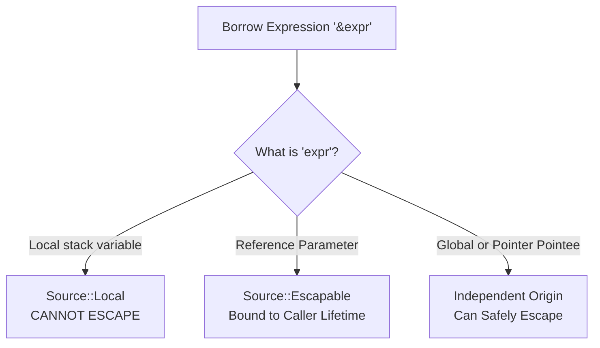

# Borrowing & Escape Analysis

Silver provides first-class reference types (`&T` and `&mut T`) combined with static escape analysis to prevent dangling references without runtime garbage collection.

---

## 1. Reference Types & Syntax

Silver distinguishes between owned values, raw pointers, and tracked references:

| Type Syntax | Meaning | Ownership | Mutability | Nullable? |
|---|---|---|---|---|
| `T` | Owning Value | Yes (dropped on exit) | Value mutable if binding is mutable | No |
| `&T` | Immutable Reference | No (borrowed view) | Read-only | No |
| `&mut T` | Mutable Reference | No (borrowed view) | Read-write | No |
| `T*` | Raw Pointer | No (manual management) | Read-write | Yes (`(T*)0`) |

### Example Usage

```silver
struct Point {
    f64 x;
    f64 y;
}

// Immutable borrow: caller retains ownership, callee reads
f64 length_squared(&Point p) {
    return p.x * p.x + p.y * p.y;
}

// Mutable borrow: caller retains ownership, callee mutates
void translate(&mut Point p, f64 dx, f64 dy) {
    p.x = p.x + dx;
    p.y = p.y + dy;
}
```

---

## 2. The Escape Checker (`semantic/escape_check.rs`)

The escape checker verifies that **references never outlive the data they point to**.

### Borrow Origin Classification (`Source`)

Every reference expression is tagged with a borrow origin:

1. **`Source::Local` (Stack-Bound)**:
   - Created by borrowing a function-local variable (`&local`) or a by-value parameter (`&val_param`).
   - **Constraint**: Must not escape the function frame.
2. **`Source::Escapable { origins }` (Caller-Bound)**:
   - Created by borrowing from an incoming reference parameter (`&ref_param`, `&mut ref_param`, or `&self` / `&mut self`).
   - Carries the set of parameter names / indices from which it derived.
   - **Constraint**: May be returned to the caller because the caller owns the underlying referent.
3. **Independent Origins**:
   - Dereferences of raw pointers (`(*ptr)`), globals (`&GLOBAL_VAR`), and heap allocations.
   - **Constraint**: Allowed to escape as they outlive the local function frame.
4. **`Source::Opaque`**:
   - Conservative fallback for complex unclassified expressions.



---

## 3. Escape Rules & Invariants

### Rule 1: Local Stack References Cannot Escape via `return`
A reference to a local stack variable cannot be returned:

```silver
i64* bad_borrow() {
    i64 local = 42;
    return &local; // COMPILE ERROR: cannot return reference to local variable 'local'
}
```

### Rule 2: References Cannot Escape via Global Assignment
Assigning a local borrow into a global variable is rejected:

```silver
i64* GLOBAL_PTR;

void bad_escape() {
    i64 x = 100;
    GLOBAL_PTR = &x; // COMPILE ERROR: cannot store reference to local variable in global
}
```

### Rule 3: Parameter Origin Propagation
Returning a reference derived from an input parameter is valid and records the parameter origin for caller-side validation:

```silver
struct Pair {
    i64 left;
    i64 right;
}

// Valid: &pair is a caller-owned parameter
i64* get_left(&Pair pair) {
    return &pair.left;
}

// Method receiver propagation:
impl Pair {
    i64* right_ref(&Pair self) {
        return &self.right;
    }
}
```

### Rule 4: Field & Index Borrow Transparency
Borrowing a field (`&p.field`) or an array element (`&arr[i]`) preserves the borrow origin of the parent container:
- `&local_struct.field` $\rightarrow$ `Source::Local`
- `&param_ref.field` $\rightarrow$ `Source::Escapable { "param_ref" }`
