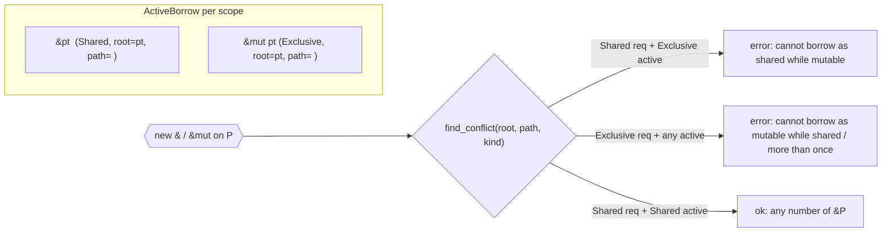

# Borrow Checking — Active Loan System

> **Scope freeze (Phase 0):** This document records the current implementation in
> `bin/agc/src/semantic/borrow_check.rs` as shipped on `move-semantics`. It does
> not change behavior. For the ownership lattice see `ownership-and-moves.md`; for
> cross-function escape origins see `borrow-and-escape.md`. AGENTS.md §6 invariants
> (drop-flag machine, pointer/reference exemption, per-field flags) are preserved.

---

## 1. What the Checker Guarantees

Single invariant, enforced at every program point (`borrow_check.rs:1-15`):

```
For any memory location P at any program point:
  (Any number of &P) XOR (Exactly one &mut P)
```

Consequences checked by `BorrowChecker` (`borrow_check.rs:102-116, 977-1143`):

1. Cannot take `&mut x` while any `&x` or `&mut x` on overlapping path is active.
2. Cannot take `&x` while any `&mut x` on overlapping path is active.
3. Cannot assign to `x` / `p.field` while any borrow overlapping that path is active.
4. Cannot `move x` / `move p.field` while any borrow overlapping that path is active.
5. Cannot read/use `x` through plain `Identifier` while an exclusive `&mut x` loan is active.
6. Raw pointers `T*` are unchecked — they bypass all of the above (AGENTS.md §6.2).

Implementation note: the checker is **statement-sequenced, not flow-sensitive across
branches**. Loans are pushed per lexical block and expired at statement boundaries
(§7). There is no per-path lattice merge — branch-local `check_block(then)` /
`check_block(else)` scopes are pushed/popped, so their loans do not leak to the
successor. This matches `borrow_and_escape.md §4` and `current-limitations-and-roadmap.md`.

---

## 2. Borrow Origins

The active checker does not classify escape origins itself — that is `escape_check.rs:Source`
(§8). Its own notion of "where did this borrow come from" is the **(root, path) pair** plus
whether the borrower is a reference-parameter reborrow.

### 2.1 Origin Table

| Origin | Silver syntax | How `borrow_check.rs` records it | Lifetime | File ref |
|---|---|---|---|---|
| **Param** (caller-owned) | `fn f(&Point p, &mut Point q)` | Inserted in `check_function` as `ActiveBorrow { root: param_name, path: "", kind, borrower: Some(param_name), param: true }` and `RefVarInfo` entry | Whole function, **never NLL-expired** (`expire_loans_before` skips `b.param`) | `borrow_check.rs:296-344` |
| **Local borrow expr** | `&Point r = &pt;` `&mut Point m = &mut pt.x;` `&Point s = &*r;` | `Reference { is_mutable, expression }` arm in `check_statement` → `register_named_borrow(binding, target, kind)` | From statement of creation until `last_use` (§7) or block exit | `borrow_check.rs:612-633, 743-803` |
| **Deref / reborrow through `*`** | `&*r` , `*p` as borrow target | `extract_root_and_path` recurses through `Unary::Dereference` → returns underlying `(root, path, ref_var)` so `&*r` aliases `r`'s loan | Same as underlying | `borrow_check.rs:735-740` |
| **Identifier reborrow** | `&Point m = r;` where `r: &Point` | `Identifier` init arm: clones `ref_bindings[ident]` into new `ActiveBorrow` + new `RefVarInfo` | Inherits underlying root/path/kind; kept alive by reborrow chain (§6.3) | `borrow_check.rs:633-659` |
| **Aggregate / struct-held** | `StringView v = { .data = &val };` `v.data = &val;` | `StructLiteral` / `Initializer` / assignment-target path in `check_statement` + `check_aggregate_field_borrow` + `check_assignment_target` assignment rewrite | Loan is `ActiveBorrow { root: val_root, path: val_path, borrower: Some(owner_name) }` — owned by the aggregate variable | `borrow_check.rs:660-683, 805-851, 853-869` |
| **Raw pointer (exempt)** | `T* p` , `&p.x` where `p: T*` | `raw_ptr_vars: FxHashSet<String>` populated for `Pointer` type vars/params; `extract_root_and_path` returns `None` if root is raw ptr; `extract_call_access` returns `None` | No loan — unchecked view (AGENTS.md §6.2) | `borrow_check.rs:111-115, 340-342, 581-583, 712-714, 878-882` |
| **Index** | `&arr[i]` | `Index { object, .. }` falls through to `extract_root_and_path(object)` — index expression is ignored for path identity | Same root, path = container's path | `borrow_check.rs:734` |

#### Classification detail (vs `escape_check.rs`)

* `escape_check.rs:Source::Local` vs `Source::Escapable { origins }` vs `Opaque` tracks **whether a reference may escape the frame** (return/global). The active checker tracks **whether a local is currently borrowed** — the two overlap only insofar as `escape_check.rs:classify_depth` and `borrow_check.rs:extract_root_and_path` both recurse through `FieldAccess` / `Index` / `Dereference` and both consult the lexical scope stack. The active checker, however, uses plain strings `root` + `path` and does not carry caller `origins` sets.

---

## 3. Shared vs Mutable — BorrowKind

Defined in `borrow_check.rs:31-44, 46-70`:

```rust
pub enum BorrowKind { Shared, Exclusive }
pub struct RefVarInfo { pub root: String, pub path: String, pub kind: BorrowKind, pub span: Span }
pub struct ActiveBorrow {
    pub root: String, pub path: String, pub kind: BorrowKind,
    pub span: Span, pub borrower: Option<String>,
    pub last_use: Option<usize>, pub param: bool,
}
```

| BorrowKind | Silver form | Construction rule | Diagnostic on conflict |
|---|---|---|---|
| `Shared` | `&T` / `&p.field` | `Reference { is_mutable: false }` **or** `let x: &T = &...` where `TypeKind::Reference { is_mutable: false }` | `cannot borrow 'P' as shared because it is already borrowed as mutable` (`borrow_check.rs:760-762, 998-1000`) |
| `Exclusive` | `&mut T` / `&mut p.field` | `Reference { is_mutable: true }` **or** `let x: &mut T = &mut ...` | `cannot borrow 'P' as mutable because it is already borrowed as shared` / `...more than once` (`borrow_check.rs:763-769, 1001-1007`) |

Multi-span notes: conflicting site gets `note_previous_borrow_here(kind.as_str())` pointing at `conflict.span`.



---

## 4. Path Model — `root + field path` Strings (Not `Place`)

> This is the most important implementation caveat to freeze before a `Place` migration.

Current representation (`borrow_check.rs:48-70, 169-177, 706-741`):

* `root: String` — base variable name (`pt`, `pair`, `node`).
* `path: String` — dot-joined field suffix (`""`, `"left"`, `"pair.right"`, `"a.b.c"`).
* `RefVarInfo` mirrors the same pair so identifier uses can resolve through a reference binding:

```rust
// borrow_check.rs:706-741
fn extract_root_and_path(&self, expr: &Expression) -> Option<(String, String, Option<String>)> {
    Identifier(ident) => {
        if raw_ptr_vars.contains(ident) => return None;
        if let Some(existing) = ref_bindings.get(ident) {
            return Some((existing.root.clone(), existing.path.clone(), Some(ident.name.clone())));
        }
        Some((ident.name.clone(), String::new(), None))
    }
    FieldAccess { object, field } => {
        let (root, parent_path, ref_var) = self.extract_root_and_path(object)?;
        let path = if parent_path.is_empty() { field.name.clone() }
                   else { format!("{parent_path}.{}", field.name) };
        Some((root, path, ref_var))
    }
    Index { object, .. } => self.extract_root_and_path(object),          // index ignored
    Unary { Dereference, operand } => self.extract_root_and_path(operand), // *r → underlying
}
```

Overlap test (`borrow_check.rs:169-177`):

```rust
fn paths_overlap(p1: &str, p2: &str) -> bool {
    if p1 == p2 || p1.is_empty() || p2.is_empty() { return true; }
    let prefix1 = format!("{p1}.");
    let prefix2 = format!("{p2}.");
    p2.starts_with(&prefix1) || p1.starts_with(&prefix2)
}
```

Meaning:

* `""` (whole variable) overlaps everything on same root.
* `"a"` overlaps `"a"`, `"a.b"`, `""`, but **not** `"b"` or `"a2"`.
* `"a.b"` overlaps `"a"` and `"a.b.c"` but not `"a.c"` or `"b"`.

`find_conflict` / `find_any_borrow` / `find_mutable_borrow` then iterate scopes in
reverse and test `b.root == root && paths_overlap(b.path, path)` plus kind rules
(`borrow_check.rs:179-256`). The `ignore_borrower` parameter suppresses self-conflicts
when checking a reborrow target through its own reference variable.

**Not yet a `Place`:** no `Place { local, projection: [Field, Deref, Index] }`, no
`ProjectionElem`, no index-sensitivity, no discriminant. This is a pure string-prefix
model — adequate for `p.left` vs `p.right` but blind to `arr[0]` vs `arr[1]`.

---

## 5. Overlap & Conflict Rules

### 5.1 Borrow vs Borrow (`find_conflict`)

| Existing loan (on same `root`, overlapping path) | New request | Result |
|---|---|---|
| `Shared` | `Shared` | **Allowed** — any number of `&P` |
| `Shared` | `Exclusive` | **Rejected** — `cannot borrow as mutable while shared` |
| `Exclusive` | `Shared` | **Rejected** — `cannot borrow as shared while mutable` |
| `Exclusive` | `Exclusive` | **Rejected** — `cannot borrow as mutable more than once` |

### 5.2 Borrow vs Mutation / Move

| Existing loan (any kind, overlapping path) | Operation | Check | Diagnostic |
|---|---|---|---|
| any `&P` / `&mut P` | `x = val` / `p.left = val` with overlapping `root.path` | `find_any_borrow` in `check_assignment_target` | `cannot assign to 'P' because it is borrowed` |
| any `&mut P` (or any for move) | `move x` / `move p.left` | `find_any_borrow` in `Move` arm | `cannot move out of 'P' because it is borrowed` |
| `Exclusive &mut P` | plain use `ident` / read `x` not through ref binding | `find_mutable_borrow` in `Identifier` arm | `cannot use 'x' because it is mutably borrowed` |

Direct assignment through a reference variable is **not** double-counted: `extract_root_and_path`
resolves through `ref_bindings`, and the `ignore_borrower` / `ref_var` plumbing prevents
`p.left = ...` where `p` is actually `&mut Pair` from aliasing itself
(`borrow_check.rs:854-869`).

### 5.3 Disjoint Fields — Allowed

```
&mut p.left  +  &mut p.right   → paths "left" vs "right" → !paths_overlap → OK
&mut n.pair.left + &mut n.pair.right → "pair.left" vs "pair.right" → OK
&p           +  &mut p.left    → "" vs "left" → paths_overlap → REJECTED (parent vs child)
```

This mirrors `borrow-and-escape.md §4.3` and is exercised in `borrow_check.rs` tests:

* `allows_disjoint_mutable_field_borrows`, `allows_shared_and_mutable_on_disjoint_fields`,
  `allows_mutable_borrow_of_disjoint_nested_fields`.

### 5.4 Intra-Call Simultaneous Access Set (`borrow_check.rs:872-975`)

Within one call `f(a1,..,an)` / `r.m(a1,..,an)` all arguments **and** the receiver are
evaluated as a simultaneous access set (`check_call_arguments`). Extracted via
`extract_call_access` as `CallAccessKind::{Exclusive, Shared, Read}`. Pairwise overlap test
on same `root` + `paths_overlap` produces three cross-product errors:

| Pair in same call | Error |
|---|---|
| `(&mut P, &mut P)` | `cannot borrow 'P' as mutable more than once in the same call` |
| `(&mut P, &P)` / `(&P, &mut P)` | `cannot borrow 'P' as mutable and shared in the same call` |
| `(&mut P, Read P)` / `(Read P, &mut P)` | `cannot access 'P' while mutably borrowed in the same call` |
| `(&P, &P)` / `(&P, Read P)` | **Allowed** |

Example: `call_two(&mut pt, &pt)` → first arg `Exclusive ""`, second `Shared ""` → rejected;
`call_fields(&mut pt.x, &mut pt.y)` → `"x"` vs `"y"` disjoint → allowed
(`borrow-and-escape.md §7`, tests `rejects_mutable_and_shared_same_call`,
`rejects_mutable_and_read_same_call`, `allows_disjoint_field_borrows_in_same_call`).

---

## 6. Reborrow

Silver automatically reborrows when an existing `&mut T` is used where `&mut T` is expected.
The checker models this without moving the original reference:

### 6.1 Patterns Accepted

```silver
struct Point { i64 x; i64 y; }

void takes_mut(&mut Point p) { p.x = p.x + 1; }
i64  length_squared(&Point p) { return p.x * p.x + p.y * p.y; }

void demo() {
    Point pt; pt.x = 10; pt.y = 20;

    // 1. Identifier reborrow — let m = r
    &Point r = &pt;
    &Point s = r;               // clones RefVarInfo{root=pt, path=""} into s; new loan borrower=s
    i64 v = length_squared(s);  // s last-used here; r stays suspended until s expires

    // 2. Deref reborrow — &*r
    &Point t = &*r;             // extract_root_and_path(*r) → (pt,"") via Dereference arm

    // 3. Call reborrow — passing &mut m
    &mut Point m = &mut pt;
    takes_mut(m);               // extract_call_access sees &mut m → Exclusive; reborrow keeps m
    // m is still the exclusive loan owner after the call

    // 4. Struct-field reborrow — storing a borrow in an aggregate
    struct StringView<'a> { &'a i64 data; i64 len; }  // borrow-and-escape.md §6
    i64 val = 42;
    StringView view; view.data = &val;  // check_aggregate_field_borrow registers loan owner=view
}
```

### 6.2 How Suspension Works

There is **no explicit suspension stack**. Instead `register_named_borrow` and the
`Identifier` reborrow arm call `find_conflict(..., ignore_borrower = ref_var)` so the
original loan is not considered conflicting with its own reborrow. The reborrow's
`RefVarInfo` points at the same `(root, path)`, so subsequent checks still see the path
as borrowed — but the borrower name differs, so the two `ActiveBorrow` entries coexist.
`last_use` on the reborrow keeps the path locked (see §7.3). Tests:
`allows_reborrow_of_mutable_reference`, `allows_shared_reborrow_through_mutable`.

### 6.3 Reference Parameter + `&mut Self`

Method receivers `(&mut Self self)` are reference parameters — `param: true`, never expired
— so `self` provides exclusive access to `self.field` without self-conflicting. This is the
same mechanism as `borrow-and-escape.md §4.6` ("Method receivers provide exclusive access").

---

## 7. Last-Use Loan Expiration — Statement-Level NLL

Loans named by `let r = &...` bindings expire **at the statement boundary after the
binding's last use**, not at the end of the lexical block. (`borrow_check.rs:349-392`,
`borrow-and-escape.md §5`, `current-limitations-and-roadmap.md §Phase 3`).

### 7.1 Mechanism

For each block, `check_block` precomputes `block_last_use: FxHashMap<String, usize>`:

```rust
// borrow_check.rs:352-367
for (i, stmt) in block.statements.iter().enumerate() {
    let uses = self.collect_stmt_uses(stmt); // scans expr tree for Identifier names
    for name in uses { block_last_use.insert(name, i); } // last overwrite wins → max i
}
block_last_uses.push(block_last_use);
// Before checking statement i:
expire_loans_before(i); // drops any loan where last_use < i && !param
```

* `collect_stmt_uses` / `collect_expr_uses` recurses through `Binary`, `Unary`, `Reference`,
  `Call`/`MethodCall`, `FieldAccess`, `Index`, `If`/`While`/`For`/`Match`/`Block`/`Asm`/`MacroCall`
  etc. (`borrow_check.rs:394-569`). Pure bookkeeping — no borrow logic.
* Each new loan's `last_use` is `get_last_use_for(borrower_name)` scanning the
  `block_last_uses` stack top-down (`borrow_check.rs:131-138`).
* `expire_loans_before(i)` drains scopes, removes matching `ActiveBorrow`s, and
  `ref_bindings.retain(|n,_| !expired.contains(n))` (`borrow_check.rs:372-392`).

### 7.2 Canonical Example

```silver
struct Point { i64 x; i64 y; }
i64 read_x(&Point p) { return p.x; }

void example() {
    Point pt; pt.x = 10; pt.y = 20;

    &Point r = &pt;
    i64 v = read_x(r);   // last use of 'r' is this statement (index 2)
    // expire_loans_before(3) drops the loan borrower=r because 2 < 3
    pt.x = 100;          // OK — loan expired, no artificial { } needed
}
```

If `r` is never used, `get_last_use_for("r")` returns `None` → loan has `last_use: None`
→ never expired → `pt.x = 100` is rejected for the whole block
(`borrow-and-escape.md §5 boundary case 1`, `borrow_check.rs` test `nll_allows_mutation_after_last_use`
vs `nll_keeps_borrow_alive_until_last_use`).

### 7.3 Interaction Rules

| Situation | Expiration |
|---|---|
| Reference binding `r` last used at stmt `k` in same block | Loan `borrower=r` expires before stmt `k+1` |
| Reference param `&T p` | **Never** — `param: true` guard |
| Reborrow `&Point m = &*r;` where `r` last direct use is earlier but `m` is live | Reborrow `m`'s loan keeps `(root,path)` locked; `r`'s own loan may expire but path stays covered via `m` |
| Chain `read_x(r); &Point m = &*r;` | `r` still contributes to `m`'s statement; `m`'s last use governs final expiry |

### 7.4 Boundary Cases (from `borrow-and-escape.md §5`)

* **Unused binding stays live:** `&Point r = &pt; pt.x = 100; // ERROR` — no use observed.
* **Reference params never expire** — callee cannot assume caller released.
* **Reborrow chains survive expiry** — `r` → `m` chain example in §5.3 above.
* **Conflicts before last use unchanged** — `&mut pt` while `r` still has uses ahead is still rejected.

### 7.5 What NLL Is Not

* Not inter-procedural.
* Not control-flow-aware within a block — `last_use` is the last textual statement index
  containing the name, regardless of which branch actually executes.
* Scopes still matter: pushing/popping `scopes` around `if`/`while`/`match` arms exits loans
  created inside the arm; `expire_loans_before` only expires flat-block loans.

---

## 8. Escape Prevention — What This Pass Owns vs `escape_check.rs`

### 8.1 Responsibilities Split

| Check | Owner | Question answered |
|---|---|---|
| **Active borrow conflicts** (aliasing $\oplus$ mutability, disjoint fields, intra-call, move/mutation while borrowed) | `borrow_check.rs` | "Can I borrow/mutate/move this path *right now*?" (intra-function, statement-ordered) |
| **Lifetime escape** (local reference outlives frame) | `escape_check.rs` | "Can this `&T` value leave the function (via `return` or global store)?" |
| **Thread escape** (stack ref crosses `launch`) | `send_check.rs` | "Can this reference be sent to another thread?" |

This doc freezes the first row only; the other two are documented in
`borrow-and-escape.md §§2-3, 6` and `thread-safety-send.md`.

### 8.2 How the Active Checker Prevents Escape *Into a Move*

It does not reason about `return &local` — that is `escape_check.rs:Source::Local`
→ error `cannot return reference to local variable` / `cannot store reference to local
variable in global`. The active checker instead prevents the **dual hazard**:

```silver
&Point r = &pt;
Owned a = move pt;      // REJECTED here: cannot move out of 'pt' because it is borrowed
                        // (Move arm, find_any_borrow, msg::cannot_move_out_of_borrowed)
```

This guards the same memory as `semantic/move_check.rs` but for the borrow dimension:
`move_check.rs:VarState` tracks *moved-ness* lattice; `borrow_check.rs` tracks *borrowed-ness*
and intersects at the `Move` expression kind. Both are required — one without the other
would allow use-after-free.

### 8.3 Field-Level Move vs Borrow

```silver
struct Pair { Owned left; Owned right; }
Pair p; p.left = Owned.new(1); p.right = Owned.new(2);

&Pair r = &p;
Owned a = move p.left;   // REJECTED: p.left overlaps "" loan on p

&i64 rl = &p.left;
Owned b = move p.right;  // OK: "left" vs "right" disjoint → !paths_overlap
Owned c = move p.left;   // REJECTED: "left" vs "left" overlaps rl
```

The string-prefix `paths_overlap` model matches the per-field drop flags in
`codegen/llvm_ir/scope.rs` and AGENTS.md §6.6 (`p.left.drop`, `p.right.drop`) — the
borrow checker prevents `move` of a still-borrowed field before the field's drop flag
would be incorrectly cleared.

### 8.4 Struct-Held Borrows (§6.4 Interaction)

When a struct aggregates a borrow, mutations of the referent are blocked until the
aggregate's last use — same NLL mechanism as plain `&T r = &val`. The aggregate's
`ActiveBorrow.borrower = owner_name` ties the loan to the aggregate's liveness, and
the loan expires when the aggregate is last used (`check_aggregate_field_borrow`
with `last_use = get_last_use_for(owner_name)`).

---

## 9. Examples Required by Contract

### 9.1 `&x` vs `move x` — Conflict

```silver
struct Owned { i64 v; }
impl Drop<Owned> for Owned { void drop(Owned* self) {} }

void conflict() {
    Owned x; x.v = 1;
    &Owned r = &x;                 // ActiveBorrow { root=x, path="", kind=Shared, borrower=r }
    Owned y = move x;              // ERROR: cannot move out of 'x' because it is borrowed
                                   // find_any_borrow(root=x, path="") → Some(r-loan)
                                   // note: previous borrow of 'x' here (shared)
    // fix: use r then let it expire
    // i64 v = r.v;  // last use of r
    // Owned y2 = move x; // OK after expiry — but NLL must observe the use
}
```

`&mut x` variant is analogous — any loan (shared or exclusive) blocks `move`; the move arm
uses `find_any_borrow` regardless of kind (`borrow_check.rs:1020-1038`).

### 9.2 `&x.a` vs `move x.b` — Allowed (Disjoint Fields)

```silver
struct Pair { Owned left; Owned right; }
impl Drop<Owned> for Owned { void drop(Owned* self) {} }

void disjoint_ok() {
    Pair p; p.left = Owned.new(1); p.right = Owned.new(2);

    &Owned rl = &p.left;           // ActiveBorrow { root=p, path="left", kind=Shared }
    Owned b = move p.right;        // OK: "left" vs "right" → !paths_overlap
                                   // find_any_borrow(root=p, path="right") misses rl-loan

    // Also:
    &mut Owned m1 = &mut p.left;   // Exclusive "left"
    &mut Owned m2 = &mut p.right;  // Exclusive "right" → disjoint → OK
    &mut Pair mp = &mut p;         // ERROR if either field loan still live: "" overlaps "left"
}
```

Nested disjointness works: `&mut n.pair.left` vs `&mut n.pair.right` →
`"pair.left"` vs `"pair.right"` disjoint, both allowed; `&mut n.pair` (`"pair"`) would
conflict with either child.

### 9.3 Reborrow Patterns

```silver
struct Point { i64 x; i64 y; }
void takes_mut(&mut Point p) { p.x = p.x + 1; }
void takes_shared(&Point p) {}

void reborrow_demo() {
    Point pt; pt.x = 1; pt.y = 2;

    // Pattern A — identifier reborrow (let m = r)
    &Point r = &pt;
    &Point s = r;                  // s reborrows r's (pt,"") Shared loan
    takes_shared(s);               // last use of s — s-loan expires after this stmt
    // pt is unlocked here; pt.x = 99; // OK

    // Pattern B — deref reborrow (&*r, &mut *m)
    &mut Point m = &mut pt;
    &mut Point n = &mut *m;        // extract_root_and_path(*m) → (pt,"") via Dereference arm
    takes_mut(n);                  // n last use
    // m is still logically the exclusive owner but its reborrow n has expired
    // pt.x = 99; // still ERROR if m's loan still live; needs m's last use to expire
    m.x = 99;                      // OK only after m last used

    // Pattern C — call reborrow (passing &mut m to callee)
    &mut Point q = &mut pt;
    takes_mut(q);                  // q is reborrowed as &mut *q for the call
    // q suspension is implicit via ignore_borrower — no move of q

    // Pattern D — struct-held borrow keeping referent locked
    struct View<'a> { &'a i64 data; i64 len; }
    i64 val = 42;
    View<'a> view; view.data = &val;  // loan owner=view on root=val
    i64 d = *view.data;            // last use of view
    val = 100;                     // OK — view expired, NLL releases val

    // Pattern E — disjoint field reborrows from same root
    struct Outer { Point a; Point b; }
    Outer o; o.a.x = 1; o.b.y = 2;
    &mut Point ra = &mut o.a;
    &mut Point rb = &mut o.b;      // "a" vs "b" disjoint → both live
    takes_mut(ra); takes_mut(rb);
}
```

---

## 10. Tables (Acceptance)

### 10.1 Borrow Kinds

| Kind | Silver syntax | `BorrowKind` | Conflicts with | Multi-span note |
|---|---|---|---|---|
| Shared | `&T`, `&p.field`, `&*r`, `&arr[i]` | `Shared` | `Exclusive` only | `note: previous borrow here (mutable)` |
| Exclusive | `&mut T`, `&mut p.field`, `&mut *m` | `Exclusive` | `Shared` **and** `Exclusive` | `note: previous borrow here (shared/mutable)` |

Raw `T*` produces no `BorrowKind` — excluded at `extract_root_and_path` / `extract_call_access`.

### 10.2 Overlap Rules (String-Prefix Model)

| Root same? | Path A | Path B | `paths_overlap` | Borrow+Borrow result | Borrow+Move result |
|---|---|---|---|---|---|
| No | `*` | `*` | — | **Allowed** (different variable) | **Allowed** |
| Yes | `""` | `""` | true | Kind rule (§5.1) | **Rejected** |
| Yes | `""` | `"left"` | true | Kind rule | **Rejected** |
| Yes | `"left"` | `"left"` | true | Kind rule | **Rejected** |
| Yes | `"left"` | `"left.inner"` | true (prefix) | Kind rule | **Rejected** |
| Yes | `"left"` | `"right"` | **false** | **Allowed** | **Allowed** |
| Yes | `"pair.left"` | `"pair.right"` | **false** | **Allowed** | **Allowed** |
| Yes | `"pair"` | `"pair.left"` | true | Kind rule | **Rejected** |
| Yes | `"a.b"` | `"a.c"` | **false** | **Allowed** | **Allowed** |
| Yes (index) | `""` (for `arr[i]`) | `""` (for `arr[j]`) | true | Kind rule — indices are **not** distinguished | **Rejected** (conservative) |

### 10.3 Current Limitations (v1 — grounded)

| Limitation | Detail | Code location | Consequence |
|---|---|---|---|
| **String path, not `Place`** | `root: String, path: String` + `paths_overlap` prefix check; no `Place`/`Projection` enum | `borrow_check.rs:48-70, 169-177` | Cannot express discriminant, index, or `Deref` projection; `arr[0]` vs `arr[1]` spuriously overlaps |
| **Index-insensitive** | `Index { object, .. }` discards index expression | `borrow_check.rs:734, 458-461` | `&arr[0]` and `&mut arr[1]` incorrectly conflict (tracked as `""` on same root) |
| **No control-flow sensitivity** | `block_last_use` is textual last index; no branch-merge lattice; `if`/`while` scopes just push/pop | `borrow_check.rs:349-371, 1103-1136` | Loan reported live even if branch not taken; loop-carried borrows not modeled precisely |
| **Statement-level NLL only** | Expiry at `expire_loans_before(i)` statement boundaries; not expression-level | `borrow_check.rs:372-392` | Sub-statement reordering within one `;` not exploited |
| **Unused binding never expires** | `last_use: None` → `!param && last_use.is_some_and(last < i)` false → kept to block end | `borrow_check.rs:378-379, 549-552` | `&T r = &pt;` with no later use of `r` blocks mutation of `pt` for whole block |
| **Conservative on opaque exprs** | `extract_root_and_path` returns `None` on non-Identifier/Field/Index/Deref → fallback to `check_expr` recursion | `borrow_check.rs:738-740, 1016-1018` | Borrows through complex temporaries not tracked (no false positives, but incomplete) |
| **Branch `ScopeEntry` not per-path** | `move_check.rs:State` merges with `merge_with`; borrow checker simply scopes `if` arms and drops loans on `pop_scope` | `move_check.rs:111-128` vs `borrow_check.rs:158-167` | Move checker has path-sensitive lattice; borrow checker does not — asymmetry intentional for v1 |
| **No lifetime generics in this pass** | `<'a, 'b: 'a>` and `&'a T` reference-field registration is here, but lifetime *checking* beyond struct-held NLL is elsewhere | `borrow_check.rs:258-270, 805-851` + `escape_check.rs:Source::Escapable` | Lifetime bounds are trusted after parser/typeck; no outlives verification in this pass |
| **`Send` is separate** | `launch` isolation checked by `semantic/send_check.rs`, not this module | `thread-safety-send.md`, `borrow-and-escape.md §1` | Stack ref leaked to thread not caught here |

---

## 11. Code References (Grounded)

| Claim | Source span |
|---|---|
| Invariant header + 8 invariants | `bin/agc/src/semantic/borrow_check.rs:1-15` |
| `BorrowKind`, `RefVarInfo`, `ActiveBorrow` structs | `borrow_check.rs:31-70` |
| `BorrowChecker` state: `scopes`, `block_last_uses`, `struct_ref_fields`, `var_types`, `ref_bindings`, `raw_ptr_vars` | `borrow_check.rs:102-116` |
| `check_function` inserts param loans `param:true` + `ref_bindings` + `raw_ptr_vars` | `borrow_check.rs:296-347` |
| `check_block` precomputes `block_last_use` + `expire_loans_before` + `check_statement` loop | `borrow_check.rs:349-370` |
| `expire_loans_before` skips `param`, drops `ref_bindings` entries | `borrow_check.rs:372-392` |
| `collect_stmt_uses` / `collect_expr_uses` | `borrow_check.rs:394-569` |
| `check_statement`: `Reference` → `register_named_borrow`, `Identifier` reborrow clone, `StructLiteral`/`Initializer` → `check_aggregate_field_borrow` | `borrow_check.rs:571-690` |
| `extract_root_and_path` (Identifier/ref_var/raw_ptr/Field/Index/Deref) | `borrow_check.rs:706-741` |
| `register_named_borrow` (conflict check + push `ActiveBorrow` + `RefVarInfo`) | `borrow_check.rs:743-803` |
| `check_aggregate_field_borrow` (field `&T` guard via `struct_ref_fields`/`var_types`) | `borrow_check.rs:805-851` |
| `check_assignment_target` (`find_any_borrow`) | `borrow_check.rs:853-869` |
| `extract_call_access` + `check_call_arguments` (simultaneous set, pairwise overlap, three diagnostics) | `borrow_check.rs:872-975` |
| `check_expr`: `Reference` conflict, `Move`→`find_any_borrow`, `Identifier`→`find_mutable_borrow`, `Binary::Assign`→`check_assignment_target` | `borrow_check.rs:977-1071` |
| `paths_overlap` string-prefix logic | `borrow_check.rs:169-177` |
| `find_conflict` / `find_any_borrow` / `find_mutable_borrow` (scope-reverse, `ignore_borrower`) | `borrow_check.rs:179-256` |
| `Source::{Local, Escapable{origins}, Opaque}` + `classify_depth`/`classify_deref` (escape origin classification) | `bin/agc/src/semantic/escape_check.rs:59-68, 234-337` |
| `Checker::check_function` `Source::Escapable` for `Reference` params; `return_origins` caller mapping | `escape_check.rs:150-199` |
| `VarState` 3-level lattice + `moved_fields` (move tracking, contrast) | `bin/agc/src/semantic/move_check.rs:37-128` |
| Per-field drop flags + assignment pre-drop + field cascade | `bin/agc/src/codegen/llvm_ir/scope.rs` (drop-flag emission) + AGENTS.md §6.6 |
| `T*` / `&T` / `&mut T` view vs owning distinction | AGENTS.md §6.1-6.2; `std/mem` allocators, `std/rt` |
| Struct-held borrow (`StringView<'a>`) + NLL integration | `borrow-and-escape.md §6`, `borrow_check.rs:258-271` (struct_ref_fields harvest) |

---

## 12. Relation to AGENTS.md §6 Invariants

1. **Automatic field cleanups** — borrow checker blocks `move` of borrowed fields, so the
   per-field drop flags emitted in `codegen/llvm_ir/scope.rs` are not cleared while a view
   exists.
2. **Pointer/Reference exemption** — `raw_ptr_vars` implements AGENTS.md §6.2 directly:
   `T*` dereferences bypass loans, preserving C FFI and allocator ergonomics.
3. **Explicit `move`** — every `move x` checked against `find_any_borrow`; AGENTS.md §6.3's
   `store i1 0, ptr %x.drop` is only safe because this pass rejected overlapping borrows.
4. **Defer stack** — statement-level NLL expiry (`expire_loans_before`) is ordered *before*
   defer emission; a loan expiring at `k+1` does not keep a defer alive past its last use.
5. **Per-field drop flags** (AGENTS.md §6.6) — `p.left.drop` / `p.right.drop` / field cascade
   rely on `&p.left` vs `move p.right` disjointness being recognized; the string path model
   is the current implementation of that disjointness.
6. **Enum payload ownership** (AGENTS.md §6.7) — orthogonal; enum cascade is in `move_check.rs`
   + codegen. Borrow checker treats enum variant field borrows as regular `FieldAccess` paths
   when they appear, but does not special-case payload moves beyond the generic `Move` arm.

---

*Document freeze: Phase 0. Next step is a `Place`-based model (projected Phase 1) — this file
records the string-path baseline that migration must preserve or explicitly change.*
