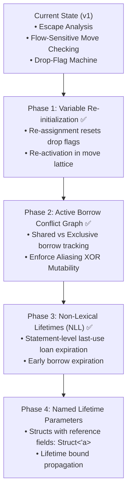

# Current State, Limitations & Future Roadmap

This document provides an engineering audit of the current borrow checker implementation in `agc` (v1), detailing active invariants, known design boundaries, and the technical roadmap for future enhancements.

---

## 1. Current State Summary (v1 Capabilities)

As of compiler version `0.2.1`, the Silver borrow and ownership system provides:

- ✅ **Flow-Sensitive Move Checking (`semantic/move_check.rs`)**:
  - Path-sensitive tracking of all `Drop`-implementing types across branches, returns, and loops.
  - Multi-span diagnostics linking use-after-move sites to their original move locations.
- ✅ **Variable Re-Initialization & Re-Activation**:
  - Moving a variable and subsequently assigning a new whole value (`x = new_value;`) re-activates the variable in the move lattice and sets its runtime drop flags back to `true`.
- ✅ **Partial Moves & Field-Level Deconstruction**:
  - Moving a specific struct field (`move p.left`) marks that individual field as moved in `move_check`, leaving remaining fields accessible.
  - Sub-field moves (e.g. `move node.pair.left`) and field re-initialization (`p.left = new_val;`) supported.
  - LLVM codegen allocates per-field drop flags and clears them on partial moves, only destructing surviving fields on block exit.
- ✅ **Enum Payload Cascade & Generic Instantiation**:
  - Generic enums (`Result<T, E>`, `Optional<T>`) safely cascade payload drops on scope exit.
  - Pattern matching move bindings (`match r { Ok(move v) : v, ... }`) safely zero payload slots and transfer ownership without premature destruction.
- ✅ **Active Borrow Conflict Checking (`semantic/borrow_check.rs`)**:
  - Enforces Aliasing $\oplus$ Mutability: $(N \times \&P) \oplus (1 \times \&\text{mut } P)$.
  - Rejects overlapping mutable and shared borrows on the same path.
  - Rejects mutating or moving values while actively borrowed.
  - Supports path-aware disjoint field borrowing (`&mut p.left` and `&mut p.right` permitted concurrently).
  - **Non-Lexical Lifetimes (NLL)**: a named borrow's loan expires at the statement boundary after its binding's last use, so short-lived references no longer require artificial `{ ... }` scopes to release the root for later mutation or moves. Reference parameters and reborrow chains stay live for their full extent.
- ✅ **Escape Analysis (`semantic/escape_check.rs`)**:
  - Distinguishes function-local stack borrows (`Source::Local`) from caller-owned parameters (`Source::Escapable`).
  - Rejects returning local stack references or storing local stack references in globals.
  - Propagates borrow origins through struct field access, array indexing, and instance method receivers (`&self`, `&mut self`).
- ✅ **Deterministic RAII Codegen**:
  - Stack-allocated 1-bit drop flags (`{var}.drop`) cleared on move and checked on scope exit.
  - Return temporary saving ensuring scope defers execute cleanly before function exit without use-after-free.
- ✅ **Concurrency Isolation (`semantic/send_check.rs`)**:
  - Rejects passing stack references across `launch` thread boundaries.

---

## 2. Current Limitations & Known Boundaries

While the borrow checking system is sound and prevents aliased mutability and use-after-moves, future phases will expand compile-time expressiveness:

### 1. Temporary Borrows in Call Arguments Are Not Registered
Loan conflicts are tracked for named reference bindings and reference
parameters. A temporary borrow passed inline to a call (`f(&mut pt, pt.x)`,
`g(&*r, ...)`) is checked for conflicts with existing named loans but is not
itself registered as a loan, so overlapping access within a single call is not
flagged. This is a pre-existing boundary of the active-borrow checker
(independent of NLL); tracking call-argument borrows through the statement
would close it.

### 2. Structs Containing Named Lifetimes (`Struct<'a>`)
Structs cannot currently declare named generic lifetime parameters (e.g. `struct StringView<'a>`):
- References stored inside struct fields are currently treated as views or raw pointers.

---

## 3. Future Roadmap & Development Phases

### Phase 1: Variable Re-Initialization
- Update `semantic/move_check.rs` to detect assignment statements (`ast::StatementKind::Assignment`) whose target is a moved variable.
- Reset the variable state in the lattice back to `VarState::new_live()`.
- In codegen, store `1` into `{var_name}.drop` on re-assignment.

### Phase 2: Active Borrow Conflict Graph
- Build an active borrow table in `semantic/escape_check.rs` recording `(Variable, BorrowKind, ScopeRange)`.
- Disallow taking `&mut x` while any active `&x` or `&mut x` borrow is alive.
- Disallow moving `x` while any borrow of `x` is active.

### Phase 3: Non-Lexical Lifetimes (NLL) — ✅ Implemented
- Statement-level last-use tracking in `semantic/borrow_check.rs`: each
  statement records which reference bindings it uses; loans whose borrower was
  last used in a previous statement are expired before the next statement is
  checked, allowing subsequent mutations or moves of the root in the same
  block.
- Reference parameters keep their loans for the whole function; reborrow
  chains (`&Point m = &*r;`) keep the loan alive through the reborrow.
- Remaining refinement: registering temporary call-argument borrows as loans
  (see §2, Current Limitations).

### Phase 4: Named Struct Lifetimes
- Add lifetime parameters to parser AST (`struct View<'a> { & 'a [u8] data; }`).
- Propagate lifetime bounds across function call boundaries and return signatures.
