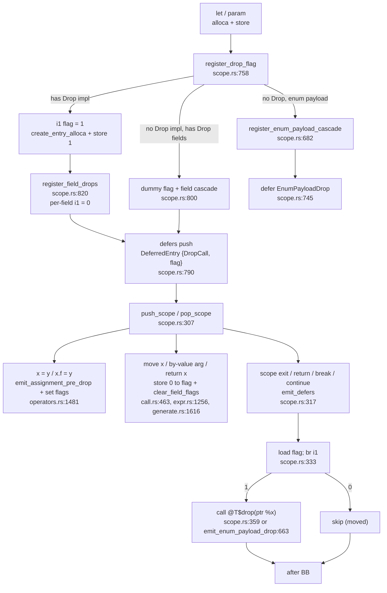

# Drop Semantics & Deterministic Destruction

Silver's deterministic destruction is a compile-time stack machine, not a runtime GC. Every owning local gets a 1-bit drop flag; a LIFO defer stack drives guarded destructor calls on scope exit. Struct fields and enum payloads cascade automatically under per-field flags. Pointers and references are never owned. This document grounds each claim in the current code — no behavior is changed.

> **Invariants preserved:** `AGENTS.md §6` invariants 1 (Automatic Field Cleanups), 2 (Pointer/Reference Exemption), 4 (Deferred Cleanup Stack), 5 (Return and Exit Handling / Bug C), 6 (Per-Field Drop Flags), 7 (Enum Payload Ownership).  
> **Core trait:** `std/mem/drop.ag` — `trait Drop { void drop(Self* self); }`.

---

## 1. Drop Pipeline (end-to-end)



**Phases in code:**

| Phase | Function | File |
|---|---|---|
| Flag + cascade registration | `register_drop_flag` | `bin/agc/src/codegen/llvm_ir/scope.rs:758` |
| Field cascade | `register_field_drops` | `bin/agc/src/codegen/llvm_ir/scope.rs:820` |
| Enum cascade | `register_enum_payload_cascade`, `emit_enum_payload_drop` | `bin/agc/src/codegen/llvm_ir/scope.rs:682`, `550` |
| Defer emission | `emit_defers` | `bin/agc/src/codegen/llvm_ir/scope.rs:317` |
| Move clearing | `clear_field_flags`, `clear_field_flags_for_path` | `bin/agc/src/codegen/llvm_ir/scope.rs:395`, `406` |
| Return save-then-defer | `Return` arm | `bin/agc/src/codegen/llvm_ir/generate.rs:1591` |
| Scope framing | `push_scope`, `pop_scope` | `bin/agc/src/codegen/llvm_ir/scope.rs:307` |
| Assignment pre-drop | `emit_assignment_pre_drop`, `emit_guarded_drop` | `bin/agc/src/codegen/llvm_ir/operators.rs:1481`, `1370` |

---

## 2. Per-Variable `i1` Drop Flag

**AGENTS.md §6.3 + §6.5** — Silver allocates a stack `i1` per tracked local.

`register_drop_flag(name, ty, var_ptr)` in `scope.rs:758`:

```llvm
%name.drop = alloca i1, align 1          ; create_entry_alloca
store i1 1, ptr %name.drop, align 1      ; initialized true = live
; var.drop_flag = Some(flag_alloca) in VarInfo (mod.rs:67)
; defers push: DeferredEntry { DropCall(drop_fn, var_ptr), flag: Some(flag) }
```

- Created via `create_entry_alloca(function, "{name}.drop", i1)` so the flag lives in the entry block (single alloca point).
- Stored in `VarInfo.drop_flag` (`mod.rs:67`). Shadowed bindings get distinct `VarInfo` entries — they never alias each other's flags.
- Only value-type variables get flags. See §5 Pointer Exemption.
- Parameters share the same path: `stmt.rs:158` calls `register_drop_flag` for each by-value parameter, then `stmt.rs:161` marks their `field_flags` live (`store 1`) because the caller's value is already initialized.

Move invalidation (`call.rs:463`, `expr.rs:1256`, `generate.rs:1616`):

```llvm
store i1 0, ptr %x.drop, align 1        ; move x / return x
; plus clear_field_flags(&x) -> store 0 to each field flag
```

For whole-struct moves this also calls `clear_field_flags` so no field survives the container move. For partial field moves (`move p.left`) the code calls `clear_field_flags_for_path("p", "left")` which zeroes `left` and `left.*` sub-flags only.

---

## 3. Defer Stack (LIFO, Flag-Guarded)

**AGENTS.md §6.4** — Scope-exit drops are a defer stack, not inline drops.

- `push_scope()` / `pop_scope()` (`scope.rs:307`) push/pop parallel `variables[]` and `defers[]` stacks per lexical block.
- Each `DeferredEntry` (`mod.rs:96`) holds `action: DeferAction` and `flag: Option<i1*>`. `DeferAction::DropCall(String, PointerValue)` is the normal variable drop; `DeferAction::EnumPayloadDrop(Type, PointerValue)` is the enum cascade; `DeferAction::Statement` is a user `defer` block (unguarded, `flag: None`).

`emit_defers(levels)` (`scope.rs:317`):

```rust
let start = total.saturating_sub(levels);
let scopes = self.defers[start..].to_vec(); // clone to avoid borrow conflicts
for mut scope in scopes.into_iter() {
    for entry in scope.iter_mut().rev() {   // LIFO within a scope
        let after_bb = if let Some(flag_ptr) = entry.flag {
            let flag_val = build_load(i1, flag_ptr);       // load defer.flag
            let run_bb = append_bb("defer.run");
            let after_bb = append_bb("defer.after");
            build_conditional_branch(flag_val, run_bb, after_bb);
            position_at_end(run_bb);
            Some(after_bb)
        } else { None };
        match &entry.action {
            DropCall(name, ptr) => call @name(ptr),        // scope.rs:359
            EnumPayloadDrop(ty, ptr) => emit_enum_payload_drop(ty, ptr), // scope.rs:367
            Statement(stmt) => generate_statement(stmt),
        }
        if let Some(after) = after_bb {
            build_unconditional_branch(after);
            position_at_end(after);
        }
    }
}
```

- `emit_defers(1)` fires only the innermost block (`stmt.rs:521`, `stmt.rs:761` for `if`/loops; `generate.rs:1522` for blocks).
- `emit_defers(n)` with `n = defers.len() - loop_base` fires enclosing scopes up to but not including the loop header for `break`/`continue` (`generate.rs:1644`, `1664`).
- `emit_defers(defers.len())` on `return` fires every active scope after the return value is saved (`generate.rs:1626`).
- `emit_defers` is also called in `stmt.rs:186` at function-body exit to drain parameter destructors left in the outer function scope.

---

## 4. Automatic Field Cascade

**AGENTS.md §6.1 + §6.6** — The compiler, not the `drop` body, drops struct fields. A struct's `drop(self*)` is for non-field resources (raw pointer, fd, handle).

`register_field_drops(ty, struct_ptr, _parent_flag)` (`scope.rs:820`):

1. Resolves `NamedType` → `named_key` → `struct_fields[named_key]` and `struct_types[named_key]`.
2. Skips `Task`, enum backing types, and enum payload layouts (they use `register_enum_payload_cascade` instead).
3. Iterates fields **in reverse** declaration order (so runtime LIFO yields declaration-order drops), for each field:
   - Recurses first: `register_field_drops(field_ty, field_ptr)` to register nested fields before the parent field's own drop (parent fires after children at runtime).
   - Skips pointer/reference fields — `is_pointer_or_reference(field_ty)` (`scope.rs:913`) is non-owning.
   - If `get_drop_function_name(field_ty)` returns `Some(drop_fn)`, allocates `field.{name}.drop: i1*`, stores `0` (definite-init: *no live value yet*), pushes `DeferredEntry { DropCall(drop_fn, field_ptr), flag: Some(field_flag) }`, and collects `(path, flag)` for the caller.

`register_drop_flag` then stores the collected `Vec<(String, i1*)>` into `VarInfo.field_flags` (`scope.rs:786`, `811`). The `field_flags` comment in `mod.rs:68` defines the contract:

> `i1*` each, initialized `false` = "field holds no live value yet", set `true` when the field is assigned, checked by the scope-exit field cascade and the assignment pre-drop.

**How flags become `true`:**

- Initialized locals: `stmt.rs:949` after `register_drop_flag`, loops over `var.field_flags` and stores `1` when `has_initializer == true`.
- By-value parameters: `stmt.rs:161` same loop (params arrive initialized from the caller).
- Whole-struct assignment: `operators.rs:1603` `set_all_field_flags(left)` marks root `drop_flag` and every field flag `1`.
- Field assignment: `operators.rs:1619` `set_assigned_field_flags(left)` marks the root flag and every flag whose path equals `x.f` or starts with `x.f.`.

**Overwriting** (`operators.rs:1481` `emit_assignment_pre_drop`):

- `x = y` (whole variable) — guarded `drop_fn` call on `target_ptr` plus guarded calls for each live nested field flag (reversed order). Guarded by `assignment_guard_flag`.
- `x.f = y` (field) — filters `field_flags` to `p == path || p.starts_with("path.")`, then guarded drops per matching flag, resolving `field_ptr` relative to `target_ptr`.
- Self-assign (`x = x`) skips pre-drop entirely (`operators.rs:381`).

---

## 5. Pointer Exemption

**AGENTS.md §6.2** — Only value-type variables own resources.

Guard in `stmt.rs:934`:

```rust
if matches!(ty.kind, Pointer(_) | Reference(_)) { return Ok(()); }
```

and in `register_field_drops` (`scope.rs:867`):

```rust
if !Self::is_pointer_or_reference(field_ty) { /* cascade */ }
```

`is_pointer_or_reference` (`scope.rs:913`) matches `TypeKind::Pointer | TypeKind::Reference`. Consequences:

- `T*`, `&T`, `&mut T`, and pointers to structs/enums never get `register_drop_flag` nor per-field flags.
- Dereferencing a pointer (`*p`) does not affect the owner's flags.
- Struct fields typed `T*` are skipped by the cascade even when the struct itself is tracked. The `drop` body must `free(self.ptr)` manually (see `Vec<T>::drop` in `std/mem/vec.ag:174`).

Raw pointers are assumed to be non-owning views. Ownership transfer for pointer-owned buffers (e.g. `malloc`) is manual — the buffer's `drop` checks `if (self.data != (T*)0) { free(self.data); }`.

---

## 6. Return, Exit & Early-Termination Handling

**AGENTS.md §6.5** — Silver avoids use-after-free on `return expr;` by saving the return value before running defers (Bug A fix).

`generate.rs:1591` `Return` arm:

```rust
let saved_value = if let Some(expr) = expr {
    let mut value = emit_expression_value(expr)?;      // evaluate first
    if let Identifier(ident) = expr.kind {              // implicit move: return x;
        if let Some(flag) = lookup_variable(&ident.name).drop_flag {
            store(flag, 0);                             // clear so defers skip it
        }
        clear_field_flags(&ident.name);
    }
    if let Some(return_ty) = self.current_return_type { value = cast_value_to_ast_type(value, &return_ty)?; }
    Some((value, span))
} else { None };
emit_defers(self.defers.len())?;                        // fire all defers (drop flags guard moved var)
if let Some((value, _)) = saved_value { build_return(Some(&value)) } else { build_return(None) }
```

Notes:

- The temporary `value: BasicValueEnum` is an SSA register, not a stack slot — the deferred drops operate on stack allocas, so saving the register before the drops is safe.
- Only bare identifiers get implicit-move treatment. `return x.field;` or `return a + b;` do **not** clear `x`'s flag — callers must write `return move x;` explicitly.
- `break`/`continue` similarly call `emit_defers(levels)` where `levels` counts scopes from current depth down to `loop_defers_base` (`generate.rs:1644`, `1664`), then branch to the loop's break/continue block.
- Functions without a terminal `return` emit `emit_defers(defers.len())` at body end (`stmt.rs:186`) then insert an implicit `ret void`/`unreachable` (`stmt.rs:192`). The check `fn may exit without returning a value` enforces that non-void functions must `return`.
- Early-exit via `abort()` / `__silver_assert_failed` never returns — they unwind through the runtime backtrace and process exit, not through `emit_defers`.

---

## 7. Per-Field Drop Flags (Definite-Init Tracking)

**AGENTS.md §6.6** — One `i1` per `Drop`-typed field, initialized `0`, set on assignment, cleared on move, checked at scope exit and before overwrite.

- **Allocation:** `register_field_drops` allocates `field.{name}.drop` per `Drop`-typed field, stores `0`.
- **Activation:** see §4 — `store 1` on struct init, by-value param entry, `x = y`, `x.f = y`.
- **Clearing:** `clear_field_flags(name)` zeroes every flag for a whole-struct move; `clear_field_flags_for_path(root, path)` zeroes `path` and `path.*` for `move x.f` (`scope.rs:395`, `406`; invoked from `call.rs:463` / `expr.rs:1256` on move expressions).
- **Checking:**
  - Scope exit: each field's `DeferredEntry` carries `Some(flag)` — `emit_defers` loads and branches per §3. Uninitialized fields (`flag == 0`) are skipped.
  - Assignment pre-drop: `emit_assignment_pre_drop` loads the same flag (`emit_guarded_drop` in `operators.rs:1370`) to decide whether to free the stale value before overwriting.

Property: overwriting a live struct field (`x.f = y`) releases the old field value (flag-guarded), overwriting a moved field skips the release, and never-initialized fields are never dropped.

---

## 8. Enum Payload Ownership

**AGENTS.md §6.7** — Enum payloads own resources when their type implements `Drop`.

### Construction

`Res.Ok(move owned)` is required when the payload type is `Drop`-typed. A bare `Res.Ok(owned)` is a compile error — the move checker enforces ownership transfer into the enum's backing storage (tag `i16` + data area sized to the largest variant).

### Storage-Independent Drop (No Own `Drop` Impl)

For enums **without** a `Drop` impl of their own that carry at least one `Drop`-typed payload, `register_enum_payload_cascade` (`scope.rs:682`) synthesizes a tag-switched cleanup:

1. Checks `enum_payload_layouts` contains the enum, substitutes generic params (e.g. `Result<T,E>` → `Result<Buffer, i32>`), and verifies at least one payload type has `get_drop_function_name == Some`.
2. Allocates `{enum_var}.drop: i1*`, stores `1`, sets `VarInfo.drop_flag`, pushes:

   ```rust
   DeferredEntry { EnumPayloadDrop(enum_ty, var_ptr), flag: Some(flag) }
   ```

3. At `emit_defers` the `EnumPayloadDrop` action runs `emit_enum_payload_drop` (`scope.rs:550`):
   - `tag_ptr = struct_gep(var_ptr, 0)`; `tag_val = load i16 tag_ptr`
   - `data_ptr = struct_gep(var_ptr, 1)` (opaque byte area)
   - For each variant with non-empty `drops: Vec<(byte_offset, drop_fn)>`, emits `if tag == tag_value { call drop_fn(data_ptr + offset) ... }` chained via `after_bb`. Zero-initialized enums carry tag `0`; no variant matches, so the zeroed payload is a no-op (null-guarded drops in user code handle the zero pointer).

### Enums With a `Drop` Impl

Enums that define their own `impl Drop<Enum> for Enum` manage payloads inside that `drop(self*)` body. `register_drop_flag` finds the enum's own drop (`get_drop_function_name` returns it on `ty` itself, not its fields), so `register_enum_payload_cascade` is never reached — no automatic tag switch is emitted.

### Extraction (`move` Bindings)

```silver
match r {
    Ok(move v) : consume(move v),
    Err(e)     : handle(e),
}
```

In `expr.rs:2755` (`match` payload binding with `is_move == true`):

- The payload is loaded from the scrutinee data area into a new local `v` (with its own drop flag = `1`).
- The **original** enum storage (`resolve_lvalue_ptr(expression)`) is patched: the variable's `drop_flag` is cleared (`store 0`) so the enum cascade will be skipped at scope exit, and the payload slot is zeroed (`store const_zero` at `slot_ptr`). This prevents the cascade from double-freeing the moved payload.

A plain binding `Ok(v)` copies the payload shallowly and the cascade still runs — for owned payloads this double-frees. Extraction must use `move`.

---

## 9. Known Limitation — Bug C (Uninitialized Locals)

**AGENTS.md §6.5** — Historically, `register_drop_flag` unconditionally stores `1` into the variable's `i1` flag, so a local declared without an initializer (`let x: Buffer;`) starts life flagged live. If `Buffer::drop` does not null-check its pointer, the scope-exit drop would free an undefined address.

Current code mitigates this in `stmt.rs:958`:

```rust
if !has_initializer {
    if let Some(flag) = var.drop_flag {
        store(flag, 0);  // clear uninitialized drop flag
    }
}
// field_flags remain 0 (never set to 1), so the cascade also skips
```

- Uninitialized locals have their **own** flag cleared to `0` immediately after `register_drop_flag`. The per-field flags are never set to `1` (see §4), so neither the struct's drop nor any field cascade fires.
- The mitigation is narrow: it covers syntactic `let x;` without an initializer. Any path where a variable is declared with a zeroed alloca and the `has_initializer` bookkeeping is inaccurate, or a field is read before it is ever assigned, still relies on the type's `drop` doing a null guard (`if (self.ptr != (T*)0) { free(...) }`). Defensive `drop` impls should always guard raw pointers.
- The limitation is documented as Bug C in `AGENTS.md §6.5` and remains a design caveat — callers cannot rely on the compiler to synthesize null guards inside their `drop` bodies.

---

## 10. Collection Leak Contract — `Vec` / `HashMap` / `HashSet`

Standard library collections free only their backing buffers. They **do NOT** iterate per-element destructors.

### `Vec<T>` — `std/mem/vec.ag:174`

```silver
impl<T> Drop for Vec<T> {
    /// Frees the backing buffer.  Does NOT call per-element destructors
    /// (the type system currently does not iterate elements on drop).
    void drop(Vec<T>* self) {
        if (self.data != (T*)0) {
            free(self.data);
            self.data = (T*)0;
        }
        self.len = 0;
        self.cap = 0;
    }
}
```

- `push` copies by POD (`self.data[len] = move value`) — for owned `T` this leaves every slot a shallow copy that shares resources with the moved-from source. Pushing owned types double-frees on drop.
- Contract (header comment `std/mem/vec.ag:10`): for owned-element types, use `get_ptr` for read-only access and `take`/`pop` to extract values before the `Vec` goes out of scope. `clear()` resets `len` without freeing, so leaked elements must be drained first. `VecIter<T>::drop` likewise only `free`s the buffer.

### `HashMap<K,V>` — `std/map.ag:425`

```silver
impl<K, V> Drop for HashMap<K, V> {
    /// Free all memory. Does NOT call per-element destructors.
    void drop(HashMap<K, V>* self) {
        if (self.ctrl != (u8*)0) {
            free(self.keys);
            free(self.values);
            free(self.ctrl);
            self.keys = (K*)0;
            self.values = (V*)0;
            self.ctrl = (u8*)0;
        }
        self.capacity = 0;
        self.len = 0;
    }
}
```

- Keys/values are POD-copied into `keys[]`/`values[]`. `Drop` never iterates live `ctrl < 0x80` entries.
- Provided escapes: `take(key) -> Optional<V>`, `remove`/`erase` (tombstones; leaks owned `K`/`V` — comment `std/map.ag` and `std/collections/set.ag:246` : "Leaks owned K — use take/drain for Drop types"), `drain() -> HashMapDrain<K,V>`, `into_iter()` (nulls the map so its drop is a no-op; the iterator then owns the buffers).

### `HashSet<K>` — `std/collections/set.ag:466`

```silver
impl<K> Drop for HashSet<K> {
    /// Frees backing memory. Does NOT iterate per-element drops.
    void drop(HashSet<K>* self) {
        if (self.ctrl != (u8*)0) {
            free(self.keys);
            free(self.ctrl);
            self.keys = (K*)0;
            self.ctrl = (u8*)0;
        }
        self.capacity = 0;
        self.len = 0;
    }
}
```

Header comment `std/collections/set.ag:6`:

> `Keys are POD-copied (K k = self.keys[idx]) — same contract as HashMap: Drop is not iterated, callers must drain before drop for owned K (String etc).`

- `erase`/`remove` and `clear` leak owned keys; use `take` or `drain`/`DrainIter` for owned `K`. `grow` internally POD-copies during rehash; free the old buffers immediately.

### Recommended pattern (owned types)

```silver
let mut m: HashMap<String, Buffer> = HashMap<String, Buffer>.new();
m.insert(move k, move v);
// ... use ...
for (entry in m.drain()) {
    // entry.key, entry.value are moved out — drop them explicitly or transfer ownership
    entry.value.drop();
}
// or: while (m.len() > 0) { Buffer b = m.take(some_key).unwrap(); consume(move b); }
// Now m's drop only frees the (now null) buffers.
```

The same discipline applies to `Vec<Buffer>` (`vec.take(idx)` / drain via `into_iter`) and `HashSet<String>` (`set.take(k)` / `drain`).

---

## 11. References

- `bin/agc/src/codegen/llvm_ir/scope.rs` — `register_drop_flag`, `register_field_drops`, `register_enum_payload_cascade`, `emit_enum_payload_drop`, `emit_defers`, `clear_field_flags*`, `push_scope`/`pop_scope`.
- `bin/agc/src/codegen/llvm_ir/mod.rs` — `VarInfo { drop_flag, field_flags }`, `DeferredEntry`, `DeferAction`.
- `bin/agc/src/codegen/llvm_ir/operators.rs` — `emit_assignment_pre_drop`, `emit_guarded_drop`, `set_all_field_flags`, `set_assigned_field_flags`.
- `bin/agc/src/codegen/llvm_ir/generate.rs` — `Return` save-before-defer.
- `bin/agc/src/codegen/llvm_ir/stmt.rs` — param/local `register_drop_flag` + flag initialization / Bug C mitigation; `emit_defers` at body exit.
- `bin/agc/src/codegen/llvm_ir/call.rs` / `expr.rs` — move flag clearing.
- `std/mem/drop.ag` — `trait Drop`.
- `std/mem/vec.ag:10,174` — POD-only push; drop frees buffer only.
- `std/map.ag:425` — `HashMap::drop` comment "Does NOT call per-element destructors".
- `std/collections/set.ag:6,466` — `HashSet::drop` same contract.
- `AGENTS.md §6` invariants 1, 2, 4, 5, 6, 7.

No compiler behavior is changed by this document.
