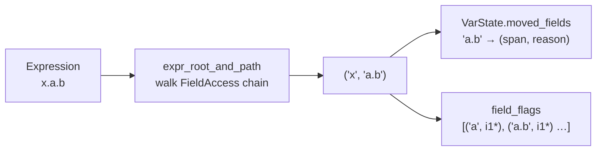
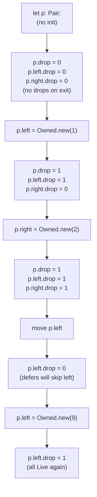

# Definite Initialization & Reinitialization

> **Scope:** This is a Phase 0 freeze document. It describes the **current** definite-initialization model as implemented on `move-semantics` without changing compiler behaviour. Every claim below is grounded in the code cited beside it.

Silver treats **moved = uninitialized**. Once a value (or a single field) has been moved, its storage is empty and must be written again before it can be read, borrowed, or dropped. Reinitialization restores the initialization state. This pairs directly with the drop-flag machine described in `AGENTS.md §6` — a cleared `i1` flag means "no live value here" — and with the flow-sensitive lattice in `bin/agc/src/semantic/move_check.rs`.

---

## 1. The Core Idea: Move Empties the Slot

From `AGENTS.md §6.3–§6.6`:

- `move x` clears the 1-bit drop flag for `x` (`store i1 0, ptr %x.drop`).
- Scope exit checks that flag; a cleared flag skips the destructor.
- A struct's drop cascades field-by-field, each with its own `i1` flag.

The semantic layer mirrors that runtime truth:

> **A moved variable is an uninitialized variable.** Any later use — reading it, borrowing it (`&x`, `&mut x`), writing through it, or assigning to a single field of a moved whole — is a use-after-free and is reported as `use of moved value 'x'` with a secondary `note: value explicitly moved here` pointing at the move site (`bin/agc/src/semantic/move_check.rs:37-43`, `431-453`, `AGENTS.md §6.3`).

Moves that empty a slot (`move_check.rs:1-11`):

| Move trigger | Lattice effect | Runtime effect |
|---|---|---|
| `move x` / `move x.field` | `mark_moved` / `mark_field_moved` | `clear_drop_flag_of` / `clear_field_flags_for_path` |
| by-value argument `take(x)` | `mark_moved` (`Facts::value_args`) | `clear_drop_flag_of` on the caller copy (`codegen/llvm_ir/call.rs:255`) |
| by-value receiver `x.consume()` | `mark_moved` (`Facts::value_receivers`) | `clear_drop_flag_of` on receiver (`call.rs:853`) |
| bare `return x;` | `mark_moved` on the identifier | `store i1 0` before running defers (`codegen/llvm_ir/generate.rs:1599`) |
| explicit `v.drop()` | `mark_moved` | `store i1 0` + `clear_field_flags` (`call.rs:943`) |
| `launch f(move x)` | `mark_moved` into child thread | ownership transferred to trampoline (`move_check.rs:703-711`) |
| `wait t` | `mark_moved` on `Task` handle | handle consumed (`move_check.rs:762-783`, `AGENTS.md §6.4` context) |

Non-owning types never enter this model: `T*`, `&T`, `&mut T` are views and are excluded by `Facts::is_view_type` (`move_check.rs:217-223`, `AGENTS.md §6.2`). Generic bindings `T x` are also untracked in v1 (see §9).

---

## 2. The Lattice: Live → PartiallyMoved → FullyMoved

Defined in `bin/agc/src/semantic/move_check.rs:37-128`:

```rust
pub struct VarState {
    pub level: u8, // 0 = Live, 1 = PartiallyMoved, 2 = FullyMoved
    pub move_span: Option<Span>,
    pub move_reason: Option<&'static str>,
    pub moved_fields: FxHashMap<String, (Span, &'static str)>,
}
```

- **`level == 0` — Live:** every field holds a live value; all uses are allowed.
- **`level == 1` — PartiallyMoved:** at least one field path in `moved_fields` is uninitialized; the whole variable cannot be used (`"use of partially moved value 'p'"` at `move_check.rs:551-560`) but sibling fields remain usable.
- **`level == 2` — FullyMoved:** the whole slot is empty; any use reports `use_of_moved_value` (`move_check.rs:540-550`, `589-608`).

Helpers:

- `is_field_moved(path)` (`move_check.rs:94-108`) checks exact matches and parent prefixes — if `a.b` is moved, then `a.b.c` is also considered moved. A whole move (`level == 2`) shadows every field path.
- `merge_with(other)` (`move_check.rs:111-128`) takes the maximum level and unions `moved_fields`, promoting `level` to `1` if any field is moved. This is the branch/loop join operator (see §7).

This three-level lattice is already documented in `docs/borrow-checker/ownership-and-moves.md §5` and `docs/borrow-checker/current-limitations-and-roadmap.md §1`; this document freezes its initialization interpretation.

---

## 3. How a Place Is Named Today: String-Based Field Paths

Silver v1 has **no `Place` abstraction**. A place is a `(root_name: String, path: String)` pair where `path` is a dot-joined field chain.

- `expr_root_and_path(expr)` (`move_check.rs:131-147`) walks `FieldAccess` nodes to the root `Identifier`, collecting field names in reverse and joining with `"."`. `x.a.b` → `("x", "a.b")`. Anything that is not a pure identifier/field chain (index `arr[i]`, deref `*p`, call result) returns `None` and is not tracked as a place.
- `VarState::moved_fields` keys are those same dot strings (`move_check.rs:62-69`). `mark_field_reinitialized` (`move_check.rs:73-84`) removes the exact key and any `"{path}."` prefix children, so reinitializing `a` also clears `a.b`, `a.b.c`, etc.
- Codegen mirrors this with `VarInfo::field_flags: Vec<(String, PointerValue)>` (`codegen/llvm_ir/mod.rs:68-70`, `scope.rs:860-898`) and `lvalue_root_and_path` in `operators.rs` / `scope.rs:406-420`.



**Consequences of this representation** (see §9): array indices, pointer dereferences, and computed lvalues are invisible to the initialization tracker; nested field moves are flattened to strings; there is no alias or projection analysis.

---

## 4. Whole-Variable Reinitialization: `x = new_value`

Assigning a whole value to a moved variable **reinitializes** it.

In `move_check.rs:825-834` (the `Binary::Assign` arm, RHS evaluated first):

```rust
if path.is_empty() {
    if state.contains_key(&root_name) {
        state.insert(root_name.clone(), VarState::new_live());
    }
}
```

- The RHS is checked first so `x = move x` would still be diagnosed before the reset.
- The variable's `VarState` is replaced with `new_live()` (`level = 0`, `moved_fields` cleared, `move_span` cleared). Subsequent reads/borrows/moves are allowed again — the slot is definite again.
- At codegen, the assignment path calls `set_all_field_flags` (`operators.rs:1603-1615`) which stores `i1 1` into the variable's own drop flag and every per-field flag. Overwriting a **live** whole variable is different: `emit_assignment_pre_drop` (`operators.rs:1481-1515`) first emits a guarded drop of the old value (see §6).

**Example — whole reinit:**

```silver
struct Owned { u8* data; i64 len; }
impl Drop for Owned {
    void drop(Owned* self) { if (self.data != (u8*)0) { free(self.data); } }
}

Owned make_owned() { Owned o; o.data = alloc<u8>(64); o.len = 64; return move o; }

void example() {
    Owned x = make_owned();
    Owned y = move x;          // x is FullyMoved (level 2) — drop flag cleared
    // use(x);                 // ERROR: use of moved value 'x'  (move_check.rs:540)
    x = make_owned();          // reinitializes x → VarState::new_live()
    use(x);                    // OK — x is Live again, drop flag is 1
}                              // x dropped once here; y dropped once; no double-free
```

This is covered by `move_check::tests::reassignment_to_moved_value_reinitializes` (`move_check.rs:1221-1224`) and exercised in `tests/assignment_drop_test.ag:32-33` where `x = move y` overwrites a live `x`.

---

## 5. Field-Level Initialization: `x.a` Is Empty, `x.b` Is Still Live

Moving a single field creates a **partial move**. The container becomes `PartiallyMoved` and only that field's path is recorded.

In `move_check.rs:596-623`:

```rust
// `move p.left` with path = "left"
var.mark_field_moved(&path, inner.span, msg::note_value_explicitly_moved());
// level 1, moved_fields = { "left": (span, reason) }
```

- `use p.left` or `move p.left` again consults `is_field_moved("left")` and reports `use of moved field 'p.left'` (`move_check.rs:609-616`, `788-810`).
- `use p` (whole) reports `use of partially moved value 'p'` (`move_check.rs:551-560`, `1300-1315`).
- `use p.right` consults `is_field_moved("right")` — not found, and no parent prefix matches — so it succeeds.

Reinitializing a single field restores **only that field**:

In `move_check.rs:835-849`:

```rust
} else if let Some(var) = state.get_mut(&root_name) {
    if var.is_fully_moved() {
        // ERROR: cannot assign to a field of a fully moved whole
    } else {
        var.mark_field_reinitialized(&path);
    }
}
```

`mark_field_reinitialized` (`move_check.rs:73-84`):

```rust
pub fn mark_field_reinitialized(&mut self, path: &str) {
    if self.level == 1 {
        self.moved_fields.remove(path);
        let prefix = format!("{path}.");
        self.moved_fields.retain(|k, _| !k.starts_with(&prefix));
        if self.moved_fields.is_empty() {
            self.level = 0; // all holes filled → Live again
            self.move_span = None;
            self.move_reason = None;
        }
    }
}
```

Assigning `p.left = new_val` removes `"left"` (and any `"left.*"` children). If `moved_fields` becomes empty, the container flips back to `Live` and a subsequent `move p` is allowed. Assigning to a field of a **fully moved** whole is rejected — the container must be reinitialized as a whole first (`move_check.rs:836-845`, `ownership-and-moves.md §3 Field-Level Protection`).

At codegen, a field move calls `clear_field_flags_for_path` (`scope.rs:406-420`) clearing `i1 0` only for that field's flag. A field assignment calls `set_assigned_field_flags` (`operators.rs:1619-1635`) setting `i1 1` for the field (and nested children) plus the root flag. Scope exit iterates per-field deferred entries guarded by their individual flags (`scope.rs:330-395`, `scope.rs:820-898` where flags are created `const_int(0, false)` — "no live value yet").

### Worked Examples (required)

All three use the same `Pair` shape from `ownership-and-moves.md §5` and `cascade_drop_test.ag`:

```silver
struct Owned { u8* data; i64 len; }
impl Drop for Owned {
    void drop(Owned* self) { if (self.data != (u8*)0) { free(self.data); } }
}
struct Pair { Owned left; Owned right; }
```

#### Example A — `move x.a; use x.a` → error

```silver
void ex_a() {
    Pair p;
    p.left  = Owned.new(1);
    p.right = Owned.new(2);

    Owned a = move p.left;   // p.left is moved → VarState { level=1, moved_fields={"left"} }
                             // codegen: store i1 0, ptr %p.left.drop ; p.right.drop stays 1

    // p.left.data;          // ERROR: use of moved field 'p.left'
                             // move_check.rs:801-807 → is_field_moved("left") finds the entry
                             // message: "use of moved field 'p.left'" + note at the `move p.left` span
}
```

#### Example B — `move x.a; use x.b` → ok

```silver
void ex_b() {
    Pair p;
    p.left  = Owned.new(1);
    p.right = Owned.new(2);

    Owned a = move p.left;   // same partial move as above

    Owned b = move p.right;  // OK: is_field_moved("right") is None, level is 1 not 2
                             // move_check.rs:814-812 branch allows it; then marks "right" moved too
                             // codegen: clears only p.right.drop; p.left.drop already 0
}
```

This is the `partial_field_move_allows_other_fields` test (`move_check.rs:1286-1297`).

#### Example C — `x.a = new; use ok` (field-level reinit)

```silver
void ex_c() {
    Pair p;
    p.left  = Owned.new(1);
    p.right = Owned.new(2);

    Owned tmp = move p.left; // p is PartiallyMoved { "left" }
    // move p;               // ERROR: use of partially moved value 'p' (move_check.rs:551)
                             // would need the whole again

    p.left = Owned.new(99);  // field reinit: mark_field_reinitialized("left")
                             // removes "left" from moved_fields; now empty → level 0 (Live)
                             // codegen: set_assigned_field_flags("left") → store i1 1 into p.left.drop

    Owned whole = move p;    // OK — p is Live again
}
```

This is `partial_field_move_reinitialization_restores_whole_use` (`move_check.rs:1318-1331`).

#### Additional — overwriting a live value vs a moved slot

```silver
// From tests/assignment_drop_test.ag:32-35 and operators.rs:1481-1515
Owned x; x.data = alloc<u8>(64); x.len = 64;
Owned y; y.data = alloc<u8>(64); y.len = 64;
x = move y;   // x was Live → emit_assignment_pre_drop runs guarded drop of old x (g_drops == 1)
              // move_check: x = new_live() (the assignment target is whole, so reinitialized)
              // y is FullyMoved after the move on the RHS
x = x;        // self-assignment: the pre-drop guard loads the flag and skips when aliasing
              // would double-free; g_drops stays 1
```

And the negative field case from `move_check::tests::field_assignment_on_moved_value_errors` (`move_check.rs:1227-1233`):

```silver
T t; move t;
// t.p = 1;  // ERROR: use of moved value 't' — cannot assign to a field of a fully moved whole
// Must do: t = T.new(); then t.p is accessible
```

#### Nested field example (string prefix rule)

```silver
struct Inner { Owned val; }
struct Outer { Inner a; Inner b; }

void nested() {
    Outer o;
    o.a.val = Owned.new(1);
    o.b.val = Owned.new(2);

    Owned v = move o.a.val;  // path "a.val" → moved_fields = {"a.val"}
    // o.a.val;              // ERROR: use of moved field 'o.a.val'
    // o.a;                  // ERROR: is_field_moved("a") walks parent prefixes and finds "a.val" — parent is considered moved
    o.b.val.data;            // OK — "b.val" not in map

    o.a.val = Owned.new(9);  // mark_field_reinitialized("a.val") clears "a.val" and "a.val.*"
                             // moved_fields empty → o is Live again
}
```

The parent-prefix walk is `is_field_moved`'s `rfind('.')` loop (`move_check.rs:101-107`); the prefix clearing is `mark_field_reinitialized`'s `retain(|k,_| !k.starts_with("a.val."))`.

---

## 6. Assignment Pre-Drop: Reinit Must Not Leak or Double-Free

Initialization interacts with destruction on overwrite. The codegen assignment path (`codegen/llvm_ir/operators.rs:1481-1515`, `1370-1398`) does:

1. **Pre-drop the overwritten value, guarded by the flag:**
   ```llvm
   %flag = load i1, ptr %x.drop
   br i1 %flag, label %predrop.run, label %predrop.after
   predrop.run: call void @Owned$drop(ptr %x)
   ```
   `emit_guarded_drop` / `emit_assignment_pre_drop` handle both the whole drop flag and, for a whole-struct overwrite, every per-field flag in reverse declaration order.

2. **Store the new value.**

3. **Set the initialization flags for the new value:**
   - whole assignment → `set_all_field_flags` (`operators.rs:1603-1615`): every `field_flags` entry and the root `drop_flag` become `1`.
   - field assignment → `set_assigned_field_flags` (`operators.rs:1619-1635`): the field's path (and sub-paths) plus the root flag become `1`.

If the overwritten slot was **already moved** (flag `0`), the guarded drop is skipped — no double-free and no spurious drop of uninitialized memory. If it was **live** (flag `1`), the old resource is freed exactly once before being overwritten. `tests/assignment_drop_test.ag:32-35` asserts both: `x = move y` frees the old `x` once, and `x = x` self-assignment does not free the still-live value a second time.

---

## 7. Definite Init at Runtime: Per-Field Drop Flags

`AGENTS.md §6.6` and `codegen/llvm_ir/scope.rs:820-902`, `codegen/llvm_ir/mod.rs:68-73`:

- Every `Drop`-typed local (and every by-value parameter via `stmt.rs:941-961`) gets an `alloca i1` drop flag and a `field_flags` vector.
- `register_field_drops` (`scope.rs:820-901`) walks struct fields in **reverse declaration order** (so LIFO defers fire in declaration order), recursively collecting nested paths. Each flag is initialized to `const_int(0, false)` — **"field holds no live value yet"** (`scope.rs:857-890`). This is the runtime side of definite init: uninitialized fields are never destructed, closing `AGENTS.md §6.5 Bug C` for fields.
- `let x;` without an initializer (`stmt.rs:948-969`) leaves both the root flag and field flags at `0`; `let x = init;` and by-value params (`stmt.rs:157-162`) immediately set them to `1` via `set_all_field_flags` / inline stores.
- Scope exit (`scope.rs:330-395`) emits `load i1; br` guards for each `DeferredEntry { flag: Some(field_flag) }`, so a partially moved struct drops only the surviving fields — directly exercised by `tests/cascade_drop_test.ag:66-82` where `move o` would skip `o`'s cascade and `Outer::drop` still runs exactly once.



---

## 8. Control-Flow Handling Today: Mergingdefinite Initialization Across Branches

The checker is **per-path dataflow** with conservative joins (`move_check.rs:16`, `880-1039`).

### 8.1 `if` / `else` — "moved on any fall-through path is moved after"

```rust
// move_check.rs:884-913
let then_terminates = block_terminates(&then_branch);
let else_terminates = else_branch.as_ref().is_some_and(block_terminates);
let mut then_state = state.clone();
let mut else_state = state.clone();
// check each branch from the pre-if state
// ...
for (name, var) in state.iter_mut() {
    let then_var = if then_terminates { VarState::default() } else { then_state.get(name).cloned().unwrap_or_default() };
    let else_var = if else_terminates { VarState::default() } else { else_state.get(name).cloned().unwrap_or_default() };
    var.merge_with(&then_var);
    var.merge_with(&else_var);
}
```

- `statement_terminates` / `block_terminates` (`move_check.rs:238-272`) recognize `return`, `break`, `continue`, and blocks whose last statement terminates (including `if`/`match` expressions where all arms terminate).
- A branch that **never falls through** contributes `VarState::default()` (Live) to the merge — its moves do not pollute the successor. This is the "dead branch doesn't count" rule from `ownership-and-moves.md §3` and `move_check::tests::conditional_move_in_terminated_branch_is_allowed` (`move_check.rs:1179-1183`):

  ```silver
  T t;
  if (c) { t.drop(); return 0; }
  t.p; // OK — the drop+return branch never falls through
  ```

- If **any** fall-through branch moves `x`, the merged state has `x` moved — use after the `if` is rejected (`move_check::tests::conditional_move_any_path_errors`, `move_check.rs:1186-1191`):

  ```silver
  T t;
  if (c) { move t; }
  // use(t) ERROR even when c is false — per-path, not per-value
  // borrow_check.rs documents the same merging philosophy for loans
  ```

`VarState::merge_with` (`move_check.rs:111-128`) unions `moved_fields` and takes the max `level`, so a partial move in one branch and a whole move in the other yields `FullyMoved` after the merge.

### 8.2 `match` — each arm is an independent path

`move_check.rs:1011-1038`: the scrutinee is checked, then each arm is checked from a clone of the pre-match state. Arms whose body never falls through (`expression_terminates`) do not contribute to `merged`. This matches the `if` rule arm-for-arm. Guards are checked for shared access and `move` bindings in guarded arms are rejected (`move_check.rs:1017-1022`).

### 8.3 Loops — fixpoint over at most 8 iterations

`move_check.rs:915-1009` for `while`, `for..in`, and C-style `for`:

```rust
for _ in 0..8 {
    let mut body_state = state.clone();
    self.check_block(body, &mut body_state, ...);
    // body_terminates → contribute default(); else contribute body_state
    // if body_var.level > var.level { var.merge_with(&body_var); changed = true; }
    if !changed { break; }
}
```

- The body may run zero or many times; moves only **accumulate** (monotone join). A body that always returns/breaks (`body_terminates`) contributes nothing to the loop-exit state, so `while (c) { move t; return 0; }` followed by `use(t)` is allowed (`move_check::tests::move_in_loop_errors_but_terminated_loop_ok`, `move_check.rs:1195-1203`).
- Otherwise, a `move t` inside the body is merged back into the pre-loop state, so `while (c) { move t; } use(t)` is rejected.

Limitations here are documented in §9 (no loop-carried reinit analysis — a `t = new` inside the loop does not restore `t` for the next iteration in the current lattice).

### 8.4 Sequencing

- Statements in a block are checked in order (`move_check.rs:459-471`); each statement sees the state left by the previous one.
- Defer bodies (`move_check.rs:517-523`) are checked with the state at registration — a defer that uses a variable later moved is caught conservatively.
- All arguments of a single `call`/`method_call` are checked as a simultaneous set for borrow conflicts first (`borrow_check.rs:258-283` intra-call checking), then move effects are applied per argument (`move_check.rs:669-702`).

---

## 9. Limitations: What the Current Model Does Not Do

These are **intentional v1 boundaries** (safe, no false positives, but incomplete). They are also summarized in `docs/borrow-checker/current-limitations-and-roadmap.md`.

| Limitation | What happens today | Where in code | Future direction |
|---|---|---|---|
| **No `Place` abstraction — string field paths only** | `x.a.b` is `"a.b"`; `arr[i]`, `*p`, `f().field` are not places (`expr_root_and_path` returns `None`) and are not tracked for partial moves or field reinit | `move_check.rs:131-147`, `scope.rs:860-898` | Introduce `Place { root, projections }` with `Deref`, `Index`, `Field` variants; unify `move_check`, `borrow_check::paths_overlap`, and `scope.rs` field flags |
| **Array / slice indices invisible** | `move arr[0]` falls through to `check_expr(object)` and is not a tracked move; `arr[0] = v` is not a field reinit | `move_check.rs:814-816`, `move_check.rs:825-852` `else` branch | Track indexed places or explicitly forbid `move arr[i]` |
| **Pointer/reference lvalues not tracked** | `*p = v` and `(*p).field` bypass `moved_fields` and `field_flags` | `Facts::is_view_type`, `register_field_drops` pointer guard | Keep exempt (views are non-owning) but document clearly |
| **Generic bindings untracked** | `T x` inside a generic function has `is_tracked == false` and no move errors are reported (v1 limitation noted in `move_check.rs:19`) | `move_check.rs:330-346` `is_tracked`, `Facts::drop_owners` | Monomorph-aware tracking or trait-bound `Drop` check |
| **`break`/`continue` conservative in loops** | Loop merge handles `body_terminates` but `break`/`continue` inside the body are not given per-edge precision; the whole body is merged conservatively | `move_check.rs:19-20`, `915-1009` | Per-edge CFG with `break`/`continue` successors |
| **No loop-carried reinit** | `while (c) { move t; t = make(); } use(t)` still reports moved after the loop because the join is monotone and does not model reinit inside the loop restoring the pre-loop state | `move_check.rs:922-941` fixpoint | Dataflow fixpoint with gen/kill sets instead of max-level merge |
| **Whole-move blocks field assignment** | `move p; p.left = v;` is rejected — must reinitialize the whole `p` first | `move_check.rs:836-845` | Could allow field-by-field reconstruction of a fully moved struct once all fields are assigned (see `current-limitations-and-roadmap.md` Phase 1 notes) |
| **Nested field prefix is string-based** | `is_field_moved("a")` reports moved if `"a.b"` is in the map via the `rfind` prefix walk; conversely `mark_field_reinitialized("a")` clears `"a.*"` but not siblings | `move_check.rs:94-108`, `73-84` | Place-aware subtree tracking |
| **Borrow overlap is also string-based** | `borrow_check.rs:211-256` `paths_overlap` uses the same dot-string prefix rule, so disjointness is syntactic | `borrow_check.rs:180-256` | Shared `Place` overlap logic |

None of these limitations cause unsoundness today — the checker is **conservative**: it may reject fewer programs than a full `Place` system would accept, but it never accepts a use-after-free for the places it does track.

---

## 10. Relation to the Other Checkers

- **Borrow checker (`bin/agc/src/semantic/borrow_check.rs`)** — enforces `(&P × N) ⊕ (&mut P × 1)` per location. It uses the same `(root, path)` string overlap (`paths_overlap`) so a partial move and a borrow on the same field path conflict consistently. Moves while borrowed are rejected (`borrow_check.rs` "cannot move ... because it is borrowed"). NLL last-use expiry (`borrow_check.rs:349-392`) means a borrow on `p.left` can expire before `move p.left`, but a borrow still live at the move site blocks it.

- **Escape checker (`bin/agc/src/semantic/escape_check.rs`)** — classifies borrow origins (`Source::Local` vs `Source::Escapable`) to forbid escaping stack references via `return` or global stores. It does not track initialization, but its `Source::Escapable` propagation through `&p.field` and `&arr[i]` uses the same field/index transparency as the initialization tracker's origin walk. Opaque expressions (stored references in structs, cross-function global stores) are conservatively treated as `Independent`/`Opaque` there, analogous to `expr_root_and_path → None` here.

- **Send checker (`bin/agc/src/semantic/send_check.rs`)** — structural `Send` check on `launch` arguments; any `launch f(move x)` that passes `Send` also marks `x` moved in the move checker, transferring ownership to the child thread.

- **Codegen (`bin/agc/src/codegen/llvm_ir/scope.rs`, `operators.rs`, `stmt.rs`, `call.rs`, `generate.rs`)** — the runtime counterpart: per-variable `drop_flag` + per-field `field_flags` (initialized `false`), guarded `DeferAction::DropCall`, and flag-clearing on every move trigger. The semantic and codegen layers agree on which places are tracked — both walk the same field chain.

---

## 11. Grounding Index

| Claim in this doc | Source |
|---|---|
| `VarState { level, moved_fields, move_span, move_reason }` | `bin/agc/src/semantic/move_check.rs:37-43` |
| `mark_moved` / `mark_field_moved` / `mark_field_reinitialized` / `is_field_moved` / `merge_with` | `move_check.rs:55-128` |
| `expr_root_and_path` field-chain walker | `move_check.rs:131-147` |
| Move triggers (explicit `move`, by-value arg, by-value receiver, bare `return`, `drop()`, `launch`, `wait`) | `move_check.rs:1-11`, `564-787` |
| Whole reinit `state.insert(new_live())` on `Assign` with empty path | `move_check.rs:825-834` |
| Field reinit `mark_field_reinitialized` and fully-moved field-assign error | `move_check.rs:835-850` |
| `if`/`match`/loop merging with `block_terminates` / `expression_terminates` and 8-iteration fixpoint | `move_check.rs:238-272`, `880-1039` |
| Per-field `i1` flags initialized `false`, set on field assignment, checked on scope exit | `codegen/llvm_ir/scope.rs:820-901`, `mod.rs:68-73`, `operators.rs:1593-1635` |
| Whole assignment `set_all_field_flags` vs field `set_assigned_field_flags` | `operators.rs:1603-1635` |
| Guarded pre-drop on overwrite `emit_assignment_pre_drop` | `operators.rs:1481-1515`, `1370-1398` |
| `let x;` leaves flags `0` (Bug C fix for fields) | `codegen/llvm_ir/stmt.rs:941-969` |
| Borrow overlap `paths_overlap` on same string paths | `bin/agc/src/semantic/borrow_check.rs:180-256` |
| Escape origin `Source::Local` / `Escapable` / independent | `bin/agc/src/semantic/escape_check.rs:53-68` |
| Drop flag machine invariants (explicit `move`, deferred stack, per-field flags, return temp) | `AGENTS.md §6` |
| `Drop` trait definition | `std/mem/drop.ag:7-9` |
| Owning stdlib types (`Box<T>`, `Vec<T>`, `String`, `VecIter<T>`) | `std/mem/box.ag:35-43`, `std/mem/vec.ag:174-185`, `std/string.ag:1-15`, `std/mem/vec.ag:263-272` |
| Field cascade and self-assignment guard tests | `tests/cascade_drop_test.ag`, `tests/assignment_drop_test.ag:32-35` |
| Move checker tests for partial moves and reinit | `bin/agc/src/semantic/move_check.rs:1286-1331` (three `partial_field_*` tests) |
| Whole-move field-assign rejection | `move_check.rs:1227-1233` `field_assignment_on_moved_value_errors` |
| Reassignment-to-moved reinit test | `move_check.rs:1221-1224` |

---

*This document is docs-only and does not change `agc` behaviour. Any divergence between prose and the cited code is a bug in the prose.*
