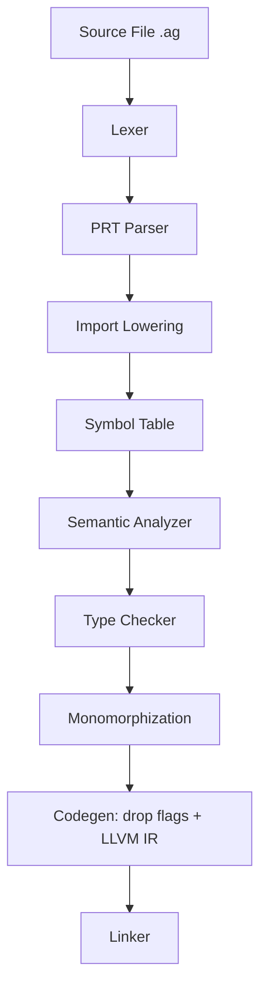
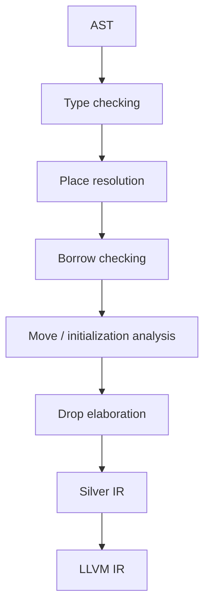
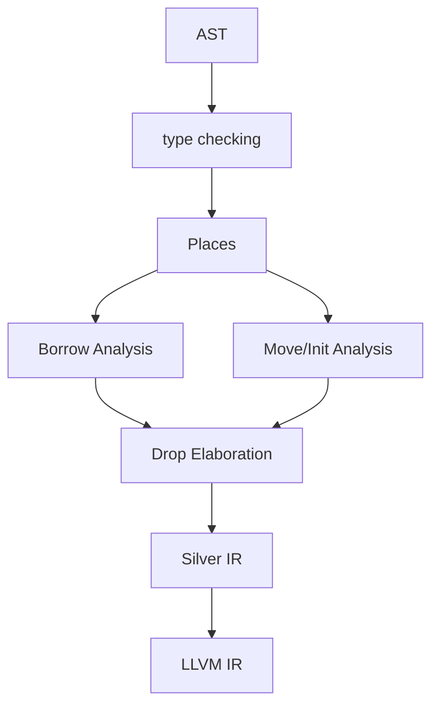

# Silver Move Semantics Roadmap

> **Status:** Phase 0 freeze — documentation only, no behavior change.
> This document is the Silver-native restatement of the overhaul plan in
> `local://paste-1.md` (§ Goal through § Definition of Done). It sits alongside
> the four Phase 0 baseline docs and the existing
> `current-limitations-and-roadmap.md` audit.
>
> Siblings written in parallel this phase:
> `ownership-and-moves.md`, `borrow-and-escape.md` (`borrow-checking.md`),
> `initialization.md`, `drop-semantics.md`, `thread-safety-send.md`.

Silver's ownership today is variable-centric: the move checker tracks `Live` /
`PartiallyMoved` / `FullyMoved` per variable with a `moved_fields` set,
borrow checking tracks `root + field-path`, and codegen synthesizes per-variable
and per-field `i1` drop flags that guard `Drop` calls at scope exit
(see `AGENTS.md` §6 and `docs/borrow-checker/ownership-and-moves.md` §3-5).
That machinery already gives us flow-sensitive use-after-move diagnostics,
field-level partial moves, and per-field drop-flag cascades — but it treats
"moved" as the primitive and has no shared notion of *where* a value lives.

The end-state principle for this roadmap, taken directly from
`local://paste-1.md` § Goal:

> **Ownership and initialization belong to places, not merely variables.**
> A move transfers ownership from one place to another and leaves the source
> place uninitialized until it is reinitialized.

When we are done, ordinary owning generic code must just work:

```text
Vec<String>
HashMap<String, Vec<u8>>
HashSet<String>
Deque<String>
```

without shallow copies, double-drops, leaks, or POD-only workarounds
(`local://paste-1.md` § Goal). The plan below gets there by promoting the
existing `expr_root_and_path()` / string-path logic into a proper `Place`
abstraction, making initialization the central state, and letting borrow
checking, move checking, and drop elaboration share that representation.

---

## 1. Baseline and Invariants (what Phase 0 freezes)

For the frozen baseline, read the four companion docs and the v1 audit:

* `docs/borrow-checker/ownership-and-moves.md` — `Drop` + drop-flag machine +
  `semantic/move_check.rs` lattice.
* `docs/borrow-checker/borrow-and-escape.md` — `&T` / `&mut T`, Aliasing
  $\oplus$ Mutability, `Source::Local` vs `Source::Escapable`, NLL last-use
  expiry, struct-held borrows (`Struct<'a>`), intra-call argument conflict sets.
* `docs/borrow-checker/drop-semantics.md` — automatic field cascades,
  per-field flags, enum payload cascades.
* `docs/borrow-checker/current-limitations-and-roadmap.md` — v1 capability
  audit and the pre-existing Phase 1-5 record (now all ✅ through intra-call
  tracking and match guards).

The compiler pipeline we are extending is `AGENTS.md` §4:



Phases 6–8 below insert distinct, ordered passes between `TypeCheck` and
`Codegen` (see §3). Until Phase 6 lands, no behavior changes.

---

## 2. Phase Table — all 16 phases

Phases are grouped as requested: foundation (0–5), pipeline (6–8),
language/stdlib + polish (9–16). Each row maps to its canonical section in
`local://paste-1.md`.

### Phase 0 — Freeze (this document)

| Phase | Title in plan | Silver scope | Exit gate |
|---|---|---|---|
| **0** | Freeze the current semantics (`local://paste-1.md` § Phase 0) | Five baseline docs under `docs/borrow-checker/`; record existing tests in `tests/memory_pentest.ag` as the regression floor. No code changes. | Docs land, tests green, reviewers agree on baseline. |

No behavior change — we need a known-good map before moving the walls.

### Phases 1–5 — Foundation: Place, Projection, MovePath, Copy

These four phases lay shared infrastructure. Each should be landable with
**no semantic change** — only a new representation under the old behavior
(`local://paste-1.md` § Phase 1–5).

| Phase | Title in plan | What Silver actually builds | Key types / ops | Gate |
|---|---|---|---|---|
| **1** | Introduce `Place` (`§ Phase 1`) | Compiler place `Place { local: LocalId, projections: Vec<Projection> }` replacing ad-hoc `expr_root_and_path()` and string-based field tracking. Initial projections: only what Silver already understands (struct fields, tuple fields). | `Place` | `x`, `x.a`, `x.a.b`, `x.0` all resolve to structurally comparable places; move checker and borrow checker can name the *same* storage location. |
| **2** | Introduce `Projection` semantics (`§ Phase 2`) | Shared helpers on `Place`: `root()`, `field()`, `index()`, `deref()`, `parent()`, `is_prefix_of()`, `overlaps()`, and the critical `places_overlap(a,b)` table. | `Projection = Field(FieldId) \| TupleField(index) \| Index(...) \| Deref` | `x.a` vs `x.a` → overlap, `x.a` vs `x.a.b` → overlap, `x.a` vs `x.b` → no overlap, `x` vs `x.a` → overlap, `x.a` vs `y.a` → no overlap — single overlap impl shared by borrow/move/init/drop. |
| **3** | Replace `moved_fields` with Move Paths (`§ Phase 3`) | Keep the `Live`/`PartiallyMoved`/`FullyMoved` semantics but re-express them as a `MovePath` / `MovePathTree` (one node per `Place`, e.g. `x ├── a ├── b,c └── d`). State becomes `Initialized` / `Uninitialized` / `PartiallyInitialized`; a move is `initialized → uninitialized`. | `MovePath`, `MovePathTree` | Old tests pass unchanged; members like `move_check.rs` no longer own a bespoke moved-field set. |
| **4** | Definite-initialization analysis (`§ Phase 4`) | Dedicated ops `read(place)`, `move_out(place)`, `initialize(place)` (and `copy_from` where `Copy` later applies). Enforces `x.a` uninitialized / `x.b` still initialized after `move x.a`, and `x.a = new_value` returns it to initialized. | `read` / `move_out` / `initialize` | `String b = move x.a` decomposes to `move_out(x.a); initialize(b)`; field reinit restores only that place. |
| **5** | Proper `Copy` properties (`§ Phase 5`) | Central `TypeProperties { is_copy, needs_drop }` so no subsystem decides "tracked?" independently. Initial Copy: `bool`, integer/float types, raw pointers, structs whose fields are all Copy. Non-Copy initially: `String`, `Vec<T>`, `Bytes`, `HashMap`, `HashSet`, `Deque`, `File`, `Mutex`, `Channel`. Rule: `T x = y` is `CopyOut(y)` if `T.is_copy` else `MoveOut(y)`; explicit `move y` is always `MoveOut(y)`. | `TypeProperties` | `i64 b = x.a` copies while `String b = move x.a` moves, without special-casing per pass. |

### Phases 6–8 — Pipeline: move / drop / borrow on Place

This is where the `AGENTS.md` pipeline visibly changes. The plan's pipeline
(`local://paste-1.md` § Phase 6–8) is adopted as Silver's target:



Borrow and move analyses run as peers over the same `Place` set, drop
elaboration is a downstream consumer of their results, and codegen stops
"figuring out ownership itself."

| Phase | Title in plan | Silver scope | Gate |
|---|---|---|---|
| **6** | Separate move analysis from drop generation (`§ Phase 6`) | Split responsibilities explicitly: the move checker answers *which places are initialized?*, the drop elaborator answers *which initialized values must be destroyed?* No new semantics yet, just the seam. | Codegen no longer re-derives ownership; defer emission consumes elaborated drops. |
| **7** | Formalize drop elaboration (`§ Phase 7`) | For `struct Foo { a:String, b:String }` + `move foo.a`, elaboration emits `drop(foo.b)` — not `drop(foo.a); drop(foo.b)`. Initially keep runtime `i1` drop flags as the correctness mechanism (hybrid): `known initialized → direct drop`, `known moved → no drop`, `dynamic → drop flag`. | Partially-moved values drop exactly their surviving fields; future static elimination is possible without changing correctness. |
| **8** | Integrate borrow checking on Place (`§ Phase 8`) | Replace borrow checker's private `root + field-path` with `Borrow { place: Place, kind: Shared \| Mutable }`. Unify overlap, enforce the required rules: `&x` + `move x` → error, `&x.a` + `move x.a` → error, `&x.a` + `move x.b` → allowed, `&mut x.a` + `x.a = value` → allowed, plus `does_move_conflict_with_borrow` / `is_place_initialized` queries. | Disjoint field borrows (`&mut p.left` + `&mut p.right`) permitted; parent/child conflicts still rejected; move-while-borrowed diagnosed with place-accurate spans. |

### Phases 9–16 — Language, stdlib, and polish

Once the pipeline is coherent, Silver can ship the user-visible wins, roughly
in dependency order (`local://paste-1.md` § Phase 9–16).

| Phase | Title in plan | Silver scope | Why this late |
|---|---|---|---|
| **9** | True move-out semantics (`§ Phase 9`) | `String b = move x.field` transfers ownership; `x.field = make()` reinitializes exactly that place; `use(x.b)` valid while `use(x.a)` errors until reinit. The fundamental acceptance test from the plan. | First phase that *changes* language semantics for users. |
| **10** | Container integration (`§ Phase 10`) | Make `Vec<T>`, `Deque<T>`, `HashMap<K,V>`, `HashSet<T>` ownership-aware. Growth must **move** non-Copy elements (`old[i] → new[i]; old[i]=uninitialized`, not a lingering initialized copy). Fix `push`/`pop`/`remove`/`swap_remove`/`replace`/`insert`/`take`/`clear`/`drop`/`rehash` to move/drop correctly for both `K` and `V`. | Stdlib trusts the new move/drop semantics; doing it earlier would bake shallow-copy workarounds into containers. |
| **11** | Container indexing (`§ Phase 11`) | Stage A: keep `v.remove(i)` / `v.pop()` / `v.take(i)` for non-Copy extraction. Stage B: introduce dynamic place `Place { root: v, projection: Index(i) }` and support `String s = move v[i]` with runtime bounds checks. | Dynamic places touch codegen, diagnostics, and borrow checking — stabilize ordinary extraction first. |
| **12** | Ownership-aware iteration (`§ Phase 12`) | Distinguish `iter(&vec)` (borrows) from `into_iter(vec)` (consumes and yields owned elements). `for s in vec` over `Vec<String>` moves each `String` out; `for s in &vec` borrows them. | Tests whether the model survives under generic `Iterator<T>` and for-loops. |
| **13** | Pattern matching (`§ Phase 13`) | Ownership-flavored patterns: for `Foo { a, b }` each binding is `Copy` / `Move` / `Borrow`, and partial destructuring creates ordinary `Place` projections so `Foo { a } = foo` has effects equivalent to `String a = move foo.a` where appropriate. | Depends on mature Place + Copy + init. |
| **14** | Control-flow dataflow (`§ Phase 14`) | Strengthen CFG merges: `if (c) { move x; } use(x)` → error (`potentially uninitialized`); `if (c) { move x; return; } use(x)` → valid. Cover `if`/`else`/loops/`break`/`continue`/`return`/nested branches/early exits/match arms with a dedicated dataflow suite. | Current lattice already handles some merges; this phase makes it path-complete. |
| **15** | Diagnostics (`§ Phase 15`) | With `Place` spans, evolve `diagnostics/messages.rs` output toward place-precise notes: `use of moved value \`foo.name\``, `cannot move \`foo.name\` because it is currently borrowed`, `cannot use \`foo\` because field \`foo.name\` has been moved` with secondary `value moved here` notes. | Semantics stable first; polish messages after. |
| **16** | Optimization (`§ Phase 16`) | Eliminate unnecessary drop flags, redundant init state, memcpy on `String a = make(); String b = move a`, and temporary allocations in `Vec<String>.grow()`. Ownership transfer should not imply a pointless memcpy for non-Copy types. | Correctness before speed; every opt must preserve once-and-only-once destruction. |

Full compiler test matrix that must pass before declaring the system finished is in
`local://paste-1.md` § Compiler test matrix (Basic, Copy, Partial move, Borrow,
Containers, Iterators, Control flow, Destruction — exactly-once, no double-drop,
no drop-after-move, no leak).

---

## 3. PR Schedule — six reviewable milestones

The plan compresses the 16 phases into six PRs (`local://paste-1.md` § Milestone
schedule). Each is sized for review, lands without breaking trunk, and preserves
the existing move/borrow behavior until PR 4.

| PR | Branch title (from plan) | Phases covered | Nature | What "done" looks like | Depends on |
|---|---|---|---|---|---|
| **PR 1** | `compiler: introduce structural Place representation` (`§ PR 1`) | 1 + 2 | Refactor only | `Place` + `Projection` + `places_overlap` land; `expr_root_and_path()` fades out; all existing tests pass with no semantic delta. | Phase 0 baseline |
| **PR 2** | `compiler: migrate borrow checker to Place` (`§ PR 2`) | 2 + 8 (borrow half) | Refactor only | `semantic/borrow_check.rs` and `semantic/escape_check.rs` operate on `Place`; intra-call sets and NLL still behave identically; Borrow = `{ place, kind }`. | PR 1 |
| **PR 3** | `compiler: replace moved-field tracking with MovePaths` (`§ PR 3`) | 3 | Refactor only | `semantic/move_check.rs` uses `MovePath`/`MovePathTree` with `Initialized`/`Uninitialized` state; behavior-preserving. | PR 2 |
| **PR 4** | `compiler: add definite initialization and Copy properties` (`§ PR 4`) | 4 + 5 | **Semantic transition** | `TypeProperties { is_copy, needs_drop }` is canonical; `read`/`move_out`/`initialize`/`copy_from` exist; `T x = y` dispatches on `is_copy`. First phase where `i64` vs `String` diverge by rule rather than convention. | PR 3 |
| **PR 5** | `compiler: implement place-based move and drop elaboration` (`§ PR 5`) | 6 + 7 + 8 (remaining) + 9 + 14 + 15 (partial) | Correctness | Split pipeline (`Place → Borrow → Move/Init → Drop elaboration → IR`) ships; partial-move + reinit + CFG merges + improved diagnostics work; owning values exercise passes. | PR 4 |
| **PR 6** | `stdlib: remove POD-only ownership restrictions` (`§ PR 6`) | 10 + 11A + 12 + 13 + 15 + 16 | Stdlib + polish | `Vec`, `Deque`, `HashMap`, `HashSet`, `Iterator` move/drop correctly; growth/rehash move rather than copy; borrowed vs owning iteration and destructuring work; exhaustive ownership tests green; optimizations opportunistic. | PR 5 |

Recommended architecture after PR 5, per `local://paste-1.md` § Recommended architecture — shown as Silver's target, not Rust's:



Core ops that everything else should be built around (`§ Recommended architecture`):

```text
read(place)
copy_from(place)
move_from(place)
initialize(place)
drop(place)
```

Stage B of Phase 11 (`move v[i]`), full Phase 16 opts, and remaining diagnostic
refinements may spill past PR 6 as follow-ups — but PR 6 is the release gate.

---

## 4. Definition of Done — the one snippet that must be correct

It is not enough that `Vec<String>` compiles. The milestone is complete only
when the example from `local://paste-1.md` § Definition of done — rewritten
here in valid Silver syntax (rather than the plan's shorthand) — compiles,
runs, and satisfies every listed guarantee:

```silver
struct User {
    String name;
    Vec<String> tags;
}

i32 test_dod() {
    Vec<User> users = Vec<User>.new();

    User u = users.pop().unwrap(); // pop() -> Optional<User>; unwrap for brevity

    // Move one field out; the other stays.
    String name = move u.name;

    // u.name is uninitialized here; using it must be a compile error.
    // use(u.name); // <- must fail: use of moved value `u.name`

    // The sibling field is still live.
    u.tags.push(move String.from("silver"));

    // Move the partially-moved value back — only the initialized
    // fields participate in drop/relocation.
    users.push(move u);

    // `name` now owns the string; `u` was consumed by push.
    assert(name.len() > 0);
    return 0;
}
```

Compiler and runtime guarantees (verbatim from the plan, § Definition of done):

```text
name      → owned by `name`
u.name    → uninitialized
u.tags    → still owned by u (until `move u` into users)
u         → safely moved back into users

with:
* no shallow ownership copies
* no double frees
* no leaks
* no use-after-move (compile-time)
* no move from borrowed storage
* correct partial destruction (drop only `u.tags`, not `u.name`)
* correct reinitialization (u.tags.push after partial move)
* correct behavior through generic containers (Vec<User>, Vec<String>)
```

That is the Silver-native statement of the plan's strategic choice
(`local://paste-1.md` closing §):

> We're not rewriting the ownership system from scratch. We're taking the
> move checker you already have, promoting its existing root/path logic into
> a proper `Place` abstraction, making initialization the central state, and
> then letting borrow checking, move checking, and drop elaboration all
> operate on the same representation.

The standard library trusts that representation. The borrow checker, move
checker, and drop elaborator share it. The diagnostics name it. This document
is only the map — behavior changes wait for PR 1.

---

## 5. References

* Plan: `local://paste-1.md` — § Goal, § Phase 0 through § Phase 16,
  § Compiler test matrix, § Recommended architecture, § Milestone schedule
  (PR 1–6), § Definition of done.
* Current audit: `docs/borrow-checker/current-limitations-and-roadmap.md` and
  its Mermaid phase chart (Phases 1–5 ✅ through NLL + intra-call tracking).
* Baseline docs: `docs/borrow-checker/ownership-and-moves.md`,
  `docs/borrow-checker/borrow-and-escape.md`,
  `docs/borrow-checker/drop-semantics.md`,
  `docs/borrow-checker/thread-safety-send.md`,
  `docs/borrow-checker/README.md`.
* Pipeline: `AGENTS.md` §4 (PRT parser → import lowering → symbol table →
  semantic → typeck → monomorph → codegen → link) and §6 (drop-flag machine
  invariants).
