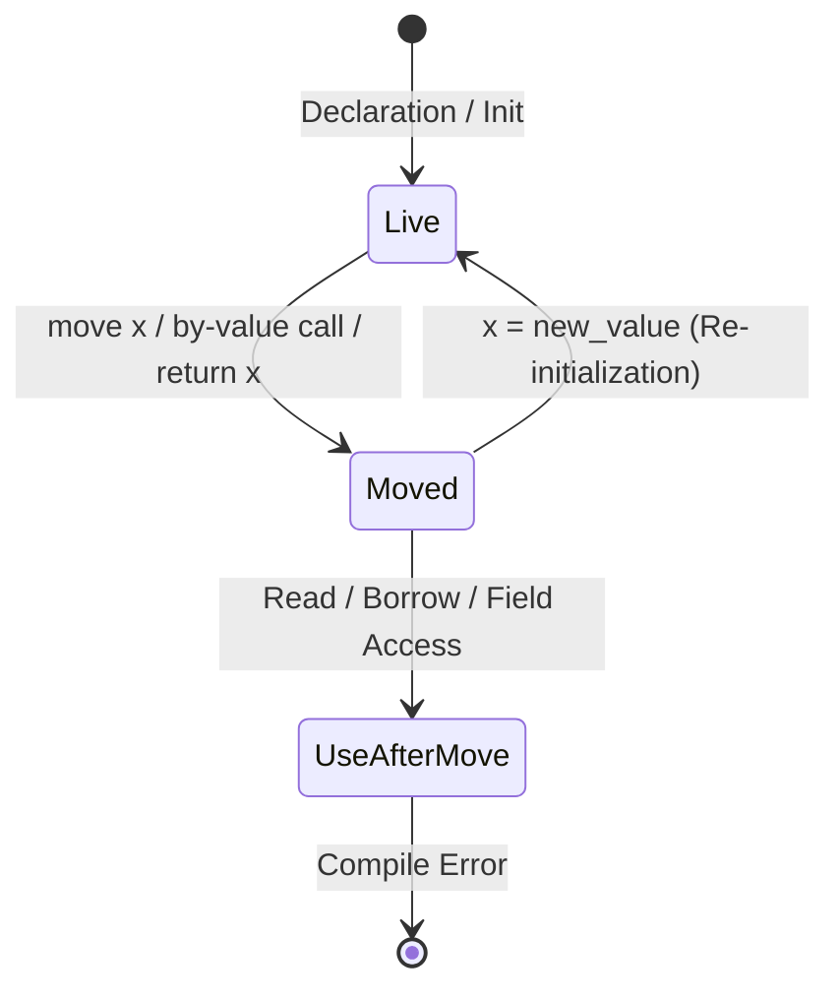

# Ownership & Move Semantics

The Silver compiler implements an ownership model paired with compile-time drop-flag synthesis and flow-sensitive move tracking.

---

## 1. Value Ownership & The `Drop` Trait

In Silver, any value of struct or enum type that implements the `Drop` trait is considered an **owning resource**:

```silver
struct FileHandle {
    i32 fd;
}

impl Drop<FileHandle> for FileHandle {
    void drop(FileHandle* self) {
        if (self.fd >= 0) {
            sys_close(self.fd);
        }
    }
}
```

### Invariants:
1. **Automatic Scope Destruction**: When an owning variable goes out of scope, the compiler automatically invokes its destructor if its drop flag is `true`.
2. **Automatic Field Cascading**: Struct fields implementing `Drop` are automatically dropped by the compiler after the parent struct's `drop()` method finishes.
3. **Pointer Exemption**: Raw pointers (`T*`), function pointers, and reference types (`&T`, `&mut T`) are views and never own the referent.

---

## 2. Move Triggers (Ownership Transfer)

A variable's ownership is transferred (invalidating the caller's binding) under five distinct conditions:

1. **Explicit Move Operator (`move x`)**:
   ```silver
   FileHandle f2 = move f1; // f1 is now moved
   ```
2. **By-Value Function / Method Arguments**:
   When passing an owned value to a parameter declared by value (`void process(FileHandle f)`):
   ```silver
   process(move f1); // or process(f1) for value parameters
   ```
3. **By-Value Method Receiver**:
   When calling a method whose receiver is declared by value (`void consume(Self self)`):
   ```silver
   f1.consume(); // f1 is consumed and moved
   ```
4. **Bare Return Value (`return x;`)**:
   Returning an owned local variable transfers ownership to the caller frame without running local destructors.
5. **Explicit Drop Invocation (`x.drop()`)**:
   Explicitly calling `.drop()` on an owned variable clears its drop flag and marks it moved.

---

## 3. Flow-Sensitive Move Checker (`semantic/move_check.rs`)

Move analysis runs across the AST before code generation. It tracks the state of every live variable through a path-sensitive lattice.

### Variable State Lattice



### Variable Re-Initialization
Assigning a new whole value to a moved variable (`x = new_value;`) is valid:
- **Move Lattice**: Resets the variable state back to `VarState::new_live()`.
- **Codegen**: Emits `store i1 1, ptr %x.drop` and sets all per-field drop flags to `true`.
- **Memory Safety**: Overwriting an already-live variable triggers pre-drop of the previous value; overwriting a moved variable skips pre-drop, preventing double-frees and memory leaks.
- **Field-Level Protection**: Assigning to a single field of a moved struct (`x.field = v;`) is rejected until the entire container is re-initialized.

### Branch Merging & Control Flow Rules

The move checker computes per-path state across branching constructs:

- **If-Else Branches**:
  - If a variable is moved in one branch and the branch falls through, the variable is considered moved in the merged successor block.
  - If a branch terminates unconditionally (`return`, `break`, `continue`), its moved state does not pollute the alternative fall-through path.
- **Loops (`while`, `for`)**:
  - Moving a variable inside a loop body that can execute multiple iterations is rejected with `cannot move out of 'x' in a loop`.

### Multi-Span Diagnostic Output

When a use-after-move error is detected, the compiler reports the error at the point of invalid use, accompanied by a secondary note pinpointing the exact move site:

```
error: test.ag:15:5: use of moved value 'handle'
15 |     handle.read();
   |     ^^^^^^
note: test.ag:12:12: value explicitly moved here
12 |     sink(move handle);
   |          ^^^^^^^^^^^
```

---

## 4. Codegen Drop-Flag Machine

At the LLVM IR level (`agc/src/codegen/llvm_ir/`):

1. **Drop Flag Allocation**:
   Every tracked local variable `x` allocates an `i1` drop flag:
   ```llvm
   %x.drop = alloca i1, align 1
   store i1 1, ptr %x.drop, align 1
   ```
2. **Move Invalidation**:
   Executing a move clears the flag:
   ```llvm
   store i1 0, ptr %x.drop, align 1
   ```
3. **Defer Stack Resolution**:
   On block exit, the compiler emits a conditional drop check:
   ```llvm
   %flag = load i1, ptr %x.drop, align 1
   br i1 %flag, label %drop.x, label %cont.x

   drop.x:
   call void @FileHandle$drop(ptr %x)
   br label %cont.x

   cont.x:
   ```
4. **Early Return Value Protection**:
   When evaluating `return expr;`, the return expression is computed into a temporary register, pending scope defers are executed, and then the function issues `ret`.

---

## 5. Partial Moves & Field-Level Deconstruction

Silver supports fine-grained deconstruction of structs through partial field moves:

```silver
struct Pair {
    Owned left;
    Owned right;
}

Pair p;
p.left = Owned.new(1);
p.right = Owned.new(2);

// Partially move the struct:
Owned a = move p.left;

// p.left cannot be used:
// use(p.left); // ERROR: use of moved field 'left' in 'p'

// But p.right remains fully accessible:
Owned b = move p.right; // OK!
```

### Invariants:
1. **Move Tracking Granularity**: `semantic/move_check.rs` maintains `VarState` with a 3-level lattice (`Live` $\rightarrow$ `PartiallyMoved` $\rightarrow$ `Moved`) and tracks individual `moved_fields`.
2. **Field Re-Initialization**: Assigning to a moved field (`p.left = new_val;`) re-initializes that field and clears it from `moved_fields`. If all fields are re-initialized, the container transitions back to `Live`.
3. **Whole-Variable Move Invalidation**: Moving the whole struct (`move p`) invalidates all fields.
4. **Per-Field Codegen Drop Flags**: The compiler synthesizes per-field drop flags (`p.left.drop`, `p.right.drop`). When a partial move occurs, only the moved field's drop flag is cleared to 0. On scope exit, the compiler only destructs the surviving fields.
