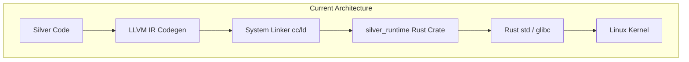
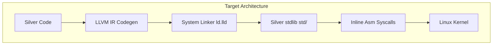

# SUPERSEDED
This plan has been fully executed. See `docs/runtime-migration.md` for the final status
of the Silver runtime migration.

# Silver Runtime Migration Plan

This document outlines a detailed, phased architecture plan for migrating the `silver_runtime/` Rust crate into a pure Silver implementation. The final goal is to completely remove glibc and Rust runtime dependencies, producing fully statically-linked Silver executables that interact directly with the Linux kernel via raw syscalls.

## Current vs. Target Architecture

The current architecture relies on compiling `silver_runtime/` as a Rust library, linking it into every generated Silver executable, which in turn calls standard library functions from Rust/glibc:



The target architecture removes both the Rust crate and glibc linkage, compiling the entire runtime as a module in the Silver standard library (`std/`), which communicates with the kernel directly through inline assembly syscalls:



---

## Syscall & Inline Assembly Infrastructure

To eliminate glibc dependencies, the compiler must support raw Linux kernel system calls. System calls on Linux x86_64 are performed using the `syscall` instruction.

### Register Layout for Linux x86_64 Syscalls
According to the System V AMD64 ABI:
*   **Syscall Number**: `%rax`
*   **Arguments**: `%rdi`, `%rsi`, `%rdx`, `%r10`, `%r8`, `%r9`
*   **Return Value**: `%rax` (preserves register state except for `%rcx` and `%r11`, which are clobbered by the kernel)

### Compiler-Side Support for Inline Assembly in LLVM IR Codegen
To support raw syscalls in Silver, the compiler needs to translate the `asm(...)` expression (represented as `ast::ExpressionKind::Asm(code)`) into LLVM inline assembly instructions. 

In `agc` (using the `inkwell` LLVM bindings wrapper), this is implemented inside `emit_expression_value` in [llvm_ir.rs](file:///home/cier/projects/silver/agc/src/codegen/llvm_ir.rs). The compiler:
1.  Defines the function type for the inline asm call (typically returning `i64` and taking the required number of parameters).
2.  Creates the inline assembly value using the context:
    ```rust
    let asm_value = self.context.create_inline_asm(
        fn_type,
        &code,
        "={rax},{rax},{rdi},{rsi},{rdx},{r10},{r8},{r9},~{rcx},~{r11}", // constraints
        true,  // has_side_effects
        false, // is_align_stack
        inkwell::context::AsmDialect::ATT,
    );
    ```
3.  Emits a call instruction invoking the inline assembly block with the provided argument values using `self.builder.build_call(asm_value, args, "asm_result")`.

### Syscall Function Signatures in Silver
We will implement raw syscall wrappers in a new module: `std/sys/syscall.ag`.

```silver
// std/sys/syscall.ag

pub i64 syscall0(i64 num) {
    i64 result;
    asm("
        movq $1, %rax
        syscall
        movq %rax, $0
    " : "=r"(result) : "r"(num) : "rax", "rcx", "r11");
    return result;
}

pub i64 syscall1(i64 num, i64 arg1) {
    i64 result;
    asm("
        movq $1, %rax
        movq $2, %rdi
        syscall
        movq %rax, $0
    " : "=r"(result) : "r"(num), "r"(arg1) : "rax", "rdi", "rcx", "r11");
    return result;
}

pub i64 syscall3(i64 num, i64 arg1, i64 arg2, i64 arg3) {
    i64 result;
    asm("
        movq $1, %rax
        movq $2, %rdi
        movq $3, %rsi
        movq $4, %rdx
        syscall
        movq %rax, $0
    " : "=r"(result) : "r"(num), "r"(arg1), "r"(arg2), "r"(arg3) : "rax", "rdi", "rsi", "rdx", "rcx", "r11");
    return result;
}

pub i64 syscall6(i64 num, i64 arg1, i64 arg2, i64 arg3, i64 arg4, i64 arg5, i64 arg6) {
    i64 result;
    asm("
        movq $1, %rax
        movq $2, %rdi
        movq $3, %rsi
        movq $4, %rdx
        movq $5, %r10
        movq $6, %r8
        movq $7, %r9
        syscall
        movq %rax, $0
    " : "=r"(result) : "r"(num), "r"(arg1), "r"(arg2), "r"(arg3), "r"(arg4), "r"(arg5), "r"(arg6) : "rax", "rdi", "rsi", "rdx", "r10", "r8", "r9", "rcx", "r11");
    return result;
}
```

---

## Phased Migration Plan

### Phase 1: Compiler Inline Assembly & Syscall Support
*   **Goal**: Add support for compiling the parsed `asm(...)` syntax in LLVM codegen and provide raw syscall wrappers.
*   **Files to Create/Modify**:
    *   [llvm_ir.rs](file:///home/cier/projects/silver/agc/src/codegen/llvm_ir.rs) — Implement `ast::ExpressionKind::Asm(code)` support in `emit_expression_value`.
    *   `std/sys/syscall.ag` (New) — Write standard raw syscall wrappers (`syscall0`, `syscall1`, `syscall3`, `syscall6`).
*   **FFI Changes**: None.
*   **Migration Strategy**:
    1.  Extend the `emit_expression_value` method in [llvm_ir.rs](file:///home/cier/projects/silver/agc/src/codegen/llvm_ir.rs) to compile the `Asm(code)` node using Inkwell's LLVM inline assembly function/call generator.
    2.  Write `std/sys/syscall.ag` to declare raw syscall wrappers using the newly supported `asm` expression.
*   **Verification**:
    *   Create a test file `tests/syscall_test.ag` executing a raw exit syscall: `syscall1(60, 42)`.
    *   Compile `syscall_test.ag` using the bootstrap compiler and verify that it returns exit code 42 directly without linking standard libc exit.

### Phase 2: Migrate Allocator to Pure Silver
*   **Goal**: Replace glibc memory allocation (`malloc`, `calloc`, `realloc`, `free`, `memset`, `memcpy`, `memmove`) with custom Silver implementations backed by `sys_mmap` and `sys_munmap` syscalls.
*   **Files to Create/Modify**:
    *   [alloc.ag](file:///home/cier/projects/silver/std/mem/alloc.ag) — Rewrite allocator to use page-aligned memory chunks requested via `mmap` syscalls.
    *   `std/mem/memory.ag` (New) — Re-implement `memset`, `memcpy`, and `memmove` as pure Silver functions.
*   **FFI Changes**:
    *   Remove glibc symbol imports (`extern "C" { malloc, free, ... }`) from [alloc.ag](file:///home/cier/projects/silver/std/mem/alloc.ag).
    *   Export Silver C-ABI FFI wrapper functions `silver_rt_alloc`, `silver_rt_alloc_zeroed`, `silver_rt_realloc`, and `silver_rt_dealloc` from [alloc.ag](file:///home/cier/projects/silver/std/mem/alloc.ag) to maintain ABI stability.
*   **Migration Strategy**:
    1.  Implement a simple page-aligned freelist allocator (or a buddy allocator) in [alloc.ag](file:///home/cier/projects/silver/std/mem/alloc.ag). The allocator will invoke `sys_mmap` (syscall 9) to request large blocks of virtual memory from the OS kernel and manage small object allocations internally.
    2.  Implement `silver_rt_alloc` and related functions as wrappers that delegate to the new allocator.
    3.  Implement `memset`, `memcpy`, and `memmove` as optimized byte-copy loops in Silver.
*   **Verification**:
    *   Rebuild standard library bootstrap and compile [mem_test.ag](file:///home/cier/projects/silver/tests/mem_test.ag) and [memory_stress.ag](file:///home/cier/projects/silver/tests/memory_stress.ag).
    *   Execute the compiled test binaries and ensure they run successfully without segfaulting.

### Phase 3: Migrate Standard I/O and Printing
*   **Goal**: Replace standard C I/O (`printf`, `puts`, `fopen`, `fwrite`, etc.) with pure Silver code wrapping raw `sys_write` and `sys_read` syscalls.
*   **Files to Create/Modify**:
    *   [io.ag](file:///home/cier/projects/silver/std/io.ag) — Completely rewrite standard I/O functions.
*   **FFI Changes**:
    *   Remove glibc stdio imports (`extern "C" { printf, fopen, ... }`).
    *   Export `silver_rt_print_i64`, `silver_rt_print_u64`, `silver_rt_print_bool`, `silver_rt_print_f64`, `silver_rt_print_cstr`, and `silver_rt_print_bytes` as top-level FFI-visible functions.
*   **Migration Strategy**:
    1.  Implement a pure Silver string formatting engine (`itoa`, `ftoa`) to convert numbers into string slices.
    2.  Implement standard output writing by calling `sys_write` (syscall 1) on file descriptor `1` (stdout) and `2` (stderr).
    3.  Redirect all `silver_rt_print_*` calls to use the new string formatting and writing routines.
*   **Verification**:
    *   Run [io_test.ag](file:///home/cier/projects/silver/tests/io_test.ag) and [file_test.ag](file:///home/cier/projects/silver/tests/file_test.ag) with the updated bootstrap library. All test cases must pass successfully.

### Phase 4: Migrate Dynamic-Dispatch Runtime and Generational GC Heap
*   **Goal**: Port the generational GC heap, method registry, type registry, and cast registry from Rust to pure Silver.
*   **Files to Create/Modify**:
    *   `std/runtime.ag` (New) — Define Heap, Handle, TypeRegistry, MethodRegistry, and CastRegistry.
    *   `std/runtime/gc.ag` (New) — Port the Mark-Sweep Generational GC implementation.
*   **FFI Changes**: None (these registries are internally resolved inside the standard library).
*   **Migration Strategy**:
    1.  Port the Heap structures (`Handle`, `Entry`, `Heap`) in [heap.rs](file:///home/cier/projects/silver/silver_runtime/src/runtime/heap.rs) to pure Silver.
    2.  Translate Rust HashMaps used in [casts.rs](file:///home/cier/projects/silver/silver_runtime/src/runtime/casts.rs) and [methods.rs](file:///home/cier/projects/silver/silver_runtime/src/runtime/methods.rs) to use [map.ag](file:///home/cier/projects/silver/std/map.ag) HashMap.
    3.  Port the mark-sweep garbage collection algorithm (`collect_garbage` method) from Rust to Silver, leveraging dynamic list traversal.
*   **Verification**:
    *   Write a test suite in Silver (`tests/runtime_test.ag`) that registers mock types and methods, triggers dynamic dispatch, allocates objects on the GC heap, and verifies garbage collection sweeps orphaned nodes correctly.

### Phase 5: Delete Rust Crate and Disable glibc Linking
*   **Goal**: Completely remove the `silver_runtime/` crate from the cargo workspace, modify the compiler driver to build in no-libc mode by default, and introduce the custom `_start` entry point.
*   **Files to Create/Modify**:
    *   [Cargo.toml](file:///home/cier/projects/silver/Cargo.toml) — Remove `silver_runtime` from workspace members.
    *   [main.rs](file:///home/cier/projects/silver/agc/src/main.rs) — Update compiler driver linking flags.
    *   `std/sys/entry.ag` (New) — Define the low-level `_start` entry point.
    *   `silver_runtime/` (Directory) — Delete entirely.
*   **FFI Changes**:
    *   No glibc library (`-lc`) or gcc runtime helper libraries (`-lgcc_s`, `-lgcc`) linked by default.
*   **Migration Strategy**:
    1.  In [main.rs](file:///home/cier/projects/silver/agc/src/main.rs), update `link_exe_with_ld_lld` and `link_exe_with_cc` to pass `-nostdlib` / `--no-std` by default. Eliminate linking standard CRT startup objects.
    2.  Write `std/sys/entry.ag` containing the x86_64 startup entry point `_start`. This function pops `argc` off the stack, retrieves the `argv` pointer, calls Silver's `main`, and invokes `sys_exit` via inline asm:
        ```silver
        pub void _start() {
            asm("
                xor %ebp, %ebp
                pop %rdi
                mov %rsp, %rsi
                call main
                mov %rax, %rdi
                mov $60, %rax
                syscall
            ");
        }
        ```
    3.  Remove the `silver_runtime` crate from the workspace.
*   **Verification**:
    *   Rebuild bootstrap.
    *   Compile any integration test (e.g., [mem_test.ag](file:///home/cier/projects/silver/tests/mem_test.ag)).
    *   Run `ldd a.out` on the compiled executable and verify it reports `not a dynamic executable` (indicating fully static, no glibc/ld.so dependency).
    *   Execute all integration tests to confirm the entire language test suite continues to pass cleanly.
